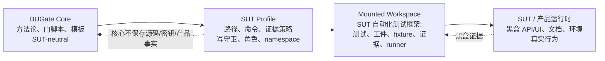

# BUGate 安装与上手（中文）

> 面向使用者的快速上手说明。**先说必须依赖**：BUGate 核心是**零三方依赖**的，唯一硬要求是 Python。
> 想直接粘给 Claude Code / Codex 当 init prompt 自动执行的英文版：见 [INIT.md](INIT.md)。

## 一句话

BUGate 是一个与被测系统（SUT）无关的、AI 驱动的黑盒测试「门」引擎。核心纯 Python 标准库实现，**clone 即用**。实际挂载时，BUGate 挂载的是 SUT 的**自动化测试框架/测试工作区**，不是把产品源码、接口快照、密钥或运行环境塞进核心仓库。

## 先选路径：导入模式（默认） vs 工作台模式（维护者）

BUGate 有两种使用形态（规范定义见 [`CHARTER.md`](CHARTER.md) §2）：

- **使用者路径 —— 导入模式（默认）。** 你要用 BUGate 治理某个 SUT 的自动化测试仓：
  先按下文完成核心验证，然后运行安装器
  `python3 scripts/bugate_init.py <sut-repo>`（或按 README「Quickstart A)
  Imported mode」手工操作）：引擎 + skill 装进 **SUT 测试仓**、在那边接线
  hooks，并把 `bugate.config.yaml` + profile **提交进 SUT 仓**。日常 agent
  会话打开的是 **SUT 测试仓**，不是本仓。Claude Code 亦可直接把本仓装为插件
  （`.claude-plugin/`，对无 `bugate.config.yaml` 的仓库自动惰性）。
- **维护者路径 —— 工作台模式。** 你在开发 BUGate 本身（core 脚本/hooks、方法论、
  profile schema、语义门、demo、跨 SUT 回归）：留在本仓，按下文「工作台模式：
  挂载 SUT 测试工作区」用软链接 + 本地不提交的 profile 指针挂载测试工作区。

## ✅ 必须依赖（只有一个）

| 依赖 | 版本 | 说明 |
|---|---|---|
| **Python** | **≥ 3.9**（推荐 3.10+） | 核心唯一硬依赖。门引擎只用标准库，**无需 `pip install` 任何三方包**，仓库也没有 `requirements.txt` 要装。 |

```bash
python3 --version    # 期望 3.9 以上
```

> 没有依赖要装——这是刻意设计：核心保持零依赖、开箱即用。

## 验证安装（零安装冒烟测试）

在仓库根目录执行，每行都应通过：

```bash
python3 -m py_compile scripts/*.py && echo "编译 OK"
python3 -c "import sys; sys.path.insert(0,'scripts'); import bugate_core; print('引擎导入 OK')"
python3 scripts/check_bugate_inventory_semantics.py .shared/skills/bugate/templates   # 期望 PASS
python3 scripts/check_bugate_brief_semantics.py     .shared/skills/bugate/templates   # 期望 PASS
```

全部通过 = 核心就绪（没有安装任何依赖）。

## 工作台模式：挂载 SUT 测试工作区（维护者路径）

> 日常治理 SUT 请用**导入模式**（见上文「先选路径」与 README Quickstart A）：
> BUGate 装进 SUT 仓、profile 提交在 SUT 仓。下面的挂载方式是**工作台**设置：
> 本仓保持项目根，profile 指针保持本地不提交。

核心默认「未挂载」（`bugate.config.yaml` 是 `mode: core`，守卫关闭）。要在真实系统上用，profile 应指向 SUT 的测试工作区：测试代码、BUGate 工件目录、测试运行命令、证据采集位置、角色隔离规则等。产品源码、API dump、密钥、环境名、固定资源 ID 仍属于 SUT/业务侧或测试工作区的外部配置，不进入 BUGate core。



1. 建一个 profile（如 `sut/<名字>.profile.yaml`），声明测试工作区路径：

   ```yaml
   artifact_dir: docs/usecases                 # 测试工作区内的用例工件（01–03…）目录
   guarded_path_regex:                         # 物理写守卫保护哪些测试文件
     - "tests/.*/test_.*[.]py$"
   required_precode_artifacts:                 # 可覆盖默认的 01–05 工件集
     - 01_business_brief.md
     - 02_testability.md
     - 03_inventory.yaml
   ```

2. 在 `bugate.config.yaml` 指向它：

   ```yaml
   profile: sut/<名字>.profile.yaml
   ```

   > 这是本地逐人的编辑 —— **不要提交**这行 `profile:`；BUGate 是通用框架，每个 clone 各自在本地挂载自己的 SUT。

   > **独立仓库?软链接挂载,不要嵌套。** 若 SUT 测试工作区是它自己的 git 仓库,把它放在独立目录里
   > 再软链接挂载(`ln -s ../my-sut my-sut`),然后**本地**忽略该软链接
   > (`printf '/my-sut\n' >> .git/info/exclude` —— 不带尾斜杠,软链接对 git 不是目录)。
   > 切勿把 SUT 仓库嵌套进 BUGate 工作树:软链接让门引擎在同样的相对路径上照常工作,
   > 而两个仓库保持完全独立的历史、远程与生命周期。

3. profile 全部字段见 [`.shared/skills/bugate/references/profile-schema.md`](.shared/skills/bugate/references/profile-schema.md)；方法论与门流程见 [`README.md`](README.md) 与 [`docs/qa-methodology/METHOD.md`](docs/qa-methodology/METHOD.md)。

## Agent 运行时（可选，无需额外安装）

在 Claude Code / Codex 里跑：技能在 `.shared/skills/bugate/`，hooks 在 `.claude/`、`.codex/`。根定位 **git-free** 且已拆分：hook 向上找 `scripts/bugate_core.py` 定位引擎；门脚本自 CWD 向上找最近的 `bugate.config.yaml` 定位被治理工作区（`AGENTS.md` + `.shared/` 哨兵为工作台 fallback）。**Codex** 改任何 hook 需在其 hook 管理界面**重新信任 hash**。这些都复用第 2 步验证过的标准库脚本，无需安装。

## 🔌 可选能力 —— 运行时你自己装，驱动脚本我们提供

零依赖核心覆盖**4 层门**。另外三套机制以**驱动脚本**形式随核心发布,它们调用你**自行安装**的运行时;运行时缺席时**优雅回退**。

### a) 双 agent 视角互审（Wave 1）

两个独立 AI agent 并行提取业务模型,在 Layer 1 通过前给出分歧报告。

- **你装:** `codex` 和 `claude` 两个 CLI(放到 `PATH`)。推荐使用官方原生安装:
  `curl -fsSL https://chatgpt.com/codex/install.sh | sh` 和
  `curl -fsSL https://claude.ai/install.sh | bash`。
- **我们提供:** `scripts/sdtd_multiview.py` + `scripts/sdtd_multiview_cli_bridge.py`。

```bash
python3 scripts/sdtd_multiview_cli_bridge.py check-env          # 显示 codex/claude 是否就位 + dispatch_mode
python3 scripts/sdtd_multiview_cli_bridge.py run-all <uc-dir>   # 两个 CLI 都在=真派发;否则占位回退
```

可用环境变量调:`SDTD_CODEX_MODEL` / `SDTD_CLAUDE_MODEL` / `SDTD_*_EFFORT`、代理 `SDTD_CLI_*_PROXY`。任一 CLI 缺失会**回退到确定性占位**,产物流照常跑。

### b) Agent 记忆 + 记忆晋级

跨会话记忆,以及「发现 → 确认/晋级」的经验沉淀闭环。

- **先探测（复用优先）:** 先跑 `bin/memory-bus-status`——总线是机器级的,本机任一仓已在托管时**无需任何安装**,只要在 profile 里声明 `memory.namespace` 即可（`bugate init` 会自动做这个探测并报告结果）。
- **你装(MCP, 仅当全机没有运行中的服务——每台机器装一次):** 推荐在宿主 checkout 的 `.venv` 里安装
  `mcp-memory-service huggingface_hub numpy onnxruntime tokenizers`,再把 ONNX
  嵌入模型一次性预下载到 `~/.cache/mcp_memory/onnx_models`(服务内置下载器走不了
  SOCKS 代理,需手动先下好)。
- **我们提供:** `scripts/memory_bus.py` + `bin/memory-bus-*` + `bin/memory-service-*` + `bin/promote-memory`。

```bash
bin/memory-bus-start                                    # 已有健康服务则直接复用,否则拉起(从 .venv 或 PATH 解析 `memory`)
bin/memory-bus-status
bin/memory-service-note --agent <a> --type finding --msg "..."
bin/promote-memory ...                                  # 把一条 finding 晋级为 status:confirmed
```

命名空间来自 SUT profile（`memory.namespace`）或 `MEMORY_BUS_PROJECT_TAG`(默认 `project:bugate`)。服务是**机器级**的（ADR-BUGATE-003）：全机一个实例,数据家目录 `~/.bugate/memory-bus/`（可用 `BUGATE_MEMORY_HOME` 覆盖;服务自身的 `MCP_MEMORY_BASE_DIR` 优先级最高）,被本机所有被治理仓共享,项目间靠 namespace tag 隔离——被治理仓只需在 profile 里声明 namespace,**不要**再脚手架本地服务目录。仓内遗留 `.memory_bus/` 仍可作为弃用回退被读取。可选 macOS 加固：`bin/memory-bus-install-launchd`（RunAtLoad + KeepAlive;`--uninstall` 卸载）。服务/CLI 缺席时,脚本打印安装提示并非致命退出。

### c) 三层 agent 角色隔离（Wave 7）

- **我们提供:** `scripts/check_agent_role_paths.py`(PreToolUse 路径守卫)。
- 用 `BUGATE_AGENT_ROLE=builder|designer|implementer` 按会话启用;禁止路径来自 SUT profile 的 `agent_roles:` 映射。未设角色 / profile 无规则 → 空操作(默认 OFF)。

## 实测踩坑清单

这组经验来自一次完整本地落地验证，后续新机器初始化时建议逐条确认：

1. **Codex / Claude Code 用官方原生安装。** 不要依赖旧 npm wrapper。若系统里有
   `@anthropic-ai/claude-code` 这类全局 npm 包，先 `npm uninstall -g
   @anthropic-ai/claude-code`，再用官方安装脚本。安装后确认:

   ```bash
   type -a codex
   type -a claude
   codex --version
   claude --version
   ```

   期望 `~/.local/bin` 在旧的 `/Applications/Codex.app/...`、Homebrew 或其他路径之前。

2. **`check-env` 只证明二进制存在，不证明账号可用。** `python3
   scripts/sdtd_multiview_cli_bridge.py check-env` 显示 `real_peer_dispatch`
   代表两个 CLI 都在 `PATH`，但真正派发还要求 Codex / Claude 已登录或配置 API
   key。Claude 未登录时，`claude -p ...` 会返回 `Not logged in`，bridge 会把该 peer
   降级为 `fallback_placeholder`。

3. **Codex CLI 参数会随版本变化。** 当前 standalone CLI 使用
   `codex exec --sandbox read-only -`；旧版可能还支持 `--ask-for-approval never`。
   bridge 会自动检测并兼容，人工排查时以 `codex exec --help` 为准。

4. **Codex skill frontmatter 必须是合法 YAML。** 如果 Codex 启动时报
   `failed to load skill ... invalid YAML`，优先检查 `.shared/skills/bugate/SKILL.md`
   的 frontmatter；带冒号的长 `description` 应加引号。

5. **memory-bus 先探测再安装；runtime 固定在宿主 checkout 的 `.venv`。** 总线是机器级共享的:
   先 `bin/memory-bus-status`,健康即复用、跳过本条。确需安装时(全机首装),注意新版
   `mcp-memory-service` 启动时会实际用到
   `numpy`、`onnxruntime`、`tokenizers` 等包，只装 `mcp-memory-service` 可能会在
   `bin/memory-bus-start` 后健康检查超时。推荐命令:

   ```bash
   python3.12 -m venv .venv
   .venv/bin/python -m pip install -U pip
   .venv/bin/python -m pip install mcp-memory-service huggingface_hub numpy onnxruntime tokenizers
   ```

6. **ONNX 模型下载要确认真的有 `.onnx`。** `bin/memory-model-fetch` 之后检查:

   ```bash
   find ~/.cache/mcp_memory/onnx_models -name '*.onnx' -print
   ```

   Hugging Face 未登录时可能较慢或卡在额外优化模型下载；只要已有可用
   `onnx/model.onnx`，memory service 通常可以启动。若必须快速降级，可临时
   `MCP_MEMORY_USE_ONNX=0 bin/memory-bus-start`。

7. **验证 memory-bus 用 BUGate wrapper。** 直接跑 `memory status` 可能看的是默认服务环境；
   总线库在系统家目录 `~/.bugate/memory-bus/`（`BUGATE_MEMORY_HOME` 可覆盖）。优先用:

   ```bash
   bin/memory-bus-status
   bin/memory-service-note --agent agent --type finding --msg "smoke"
   bin/memory-service-search --query "smoke" --limit 1
   ```

## BUGate 全功能自检 Skill / Prompt

当你完成安装、登录、memory-bus 配置后，优先直接调用项目内置 skill：

```text
Use $bugate-full-check to verify this BUGate checkout end to end.
```

这个 skill 位于 `.shared/skills/bugate-full-check/`，并通过
`.codex/skills/bugate-full-check` 与 `.claude/skills/bugate-full-check`
暴露给 Codex / Claude。它内置可执行脚本:

```bash
python3 .shared/skills/bugate-full-check/scripts/run_full_check.py --mode smoke
python3 .shared/skills/bugate-full-check/scripts/run_full_check.py --mode full
```

如果当前运行时还不能自动发现 skill，可以把下面这段 fallback prompt 直接交给
Codex 或 Claude Code，让 agent 做一次端到端体检。目标不是只看 `check-env`，
而是区分“已安装”“core 可用”“demo 可用”“真实 SUT 测试工作区已通过 profile 激活”。

```text
请在当前 BUGate 仓库做一次全功能自检，并严格遵守 AGENTS.md 与
.shared/skills/bugate/SKILL.md。

要求:
1. 先读取 .shared/skills/bugate/SKILL.md，确认当前是 core mode 还是挂载了
   SUT profile 及其自动化测试工作区。不要编造任何 SUT 事实。
2. 验证 core 4-layer gate:
   - python3 -m py_compile scripts/*.py
   - python3 scripts/check_bugate_v13_semantics.py examples/demo-sut --scope all --require-passed
3. 验证 Codex / Claude Code:
   - type -a codex; type -a claude
   - codex --version; claude --version
   - 用 codex exec 和 claude -p 各自执行一次 “Reply exactly: ok”，确认不是
     只通过 check-env，而是真能调用模型。
4. 验证双端 bridge:
   - python3 scripts/sdtd_multiview_cli_bridge.py check-env
   - python3 scripts/sdtd_adversarial_cli_bridge.py check-env
   - 复制 examples/demo-sut 到 /tmp 临时目录，在临时目录分别 run-all multi-view
     与 adversarial，确认 Codex 和 Claude 都写出 real peer view，而不是
     fallback_placeholder。
5. 验证 memory-bus:
   - bin/memory-bus-status
   - bin/memory-service-note --agent agent --type finding --msg "memory smoke"
   - bin/memory-service-search --query "memory smoke" --limit 1
   - find ~/.cache/mcp_memory/onnx_models -name '*.onnx' -print
   - MCP_MEMORY_BASE_DIR="${BUGATE_MEMORY_HOME:-$HOME/.bugate/memory-bus}" MCP_MEMORY_STORAGE_BACKEND=sqlite_vec
     MCP_MEMORY_USE_ONNX=1 PATH="$PWD/.venv/bin:$PATH" memory status
     需要看到服务 healthy，并尽量确认 onnxruntime/ONNX 路径被触发。
6. 验证 Wave 0 / Wave 8:
   - python3 scripts/check_prd_health.py --input examples/demo-sut/prd_health.yaml --gate
   - python3 scripts/oracle_falsification.py --spec examples/demo-sut/falsification_spec.yaml --gate
   - python3 scripts/generate_assertion_coverage_matrix.py --artifact-root examples/demo-sut
     --spec examples/demo-sut/falsification_spec.yaml --mutation-result <上一步 json> --output <tmp md>
   所有输出写到 /tmp，结束后清理。
7. 验证物理写守卫:
   - BUGATE_PROFILE=examples/mounted-demo/demo.profile.yaml
     python3 scripts/check_bugate.py examples/mounted-demo/tests/link/test_redirect.py </dev/null
     应返回 0。
   - 同 profile 检查 examples/mounted-demo/tests/new/test_new.py 应返回 2 并列出缺失工件。
8. 验证 Wave 7 角色隔离:
   - 用 examples/sample-sut.profile.yaml 和 BUGATE_AGENT_ROLE=implementer 测试
     sut/example/docs/source_mirror/spec.md，应被阻止。
   - 用 BUGATE_AGENT_ROLE=designer 测试 sut/example/tests/test_x.py，应被阻止。
   - 测一个允许路径，应返回 0。
9. 验证 profile hardening gates:
   - BUGATE_PROFILE=examples/sample-sut.profile.yaml
     python3 scripts/check_bugate_v13_semantics.py examples/demo-sut --scope all --require-passed
10. 清理所有 /tmp 自检产物，不要改动 SUT 事实或 demo 源文件。

最后输出一个表格，分为:
- 已安装并验证可用
- 已具备但需要真实 SUT profile / 测试工作区才能激活
- 设计上需要人工接受的 gate
- 当前仓库未脚本化或仅方法论定义的部分

结论必须明确区分:
- “BUGate core + optional runtimes 已可用”
- “真实 SUT 测试工作区的全部门禁已激活”

如果 bugate.config.yaml 仍是 mode: core 且 guarded_path_regex: []，不能宣称
真实 SUT 测试工作区全部门禁已激活，只能说 core/demo/optional runtime 已验证。
```

## 一张表看清

| 目标 | 你装什么 | 我们提供 | 缺席会怎样 |
|---|---|---|---|
| 4 层门引擎(核心) | **无** | 门脚本 + 模板 | —(永远可用) |
| 在 agent 里跑 | 无 | `.claude` / `.codex` hooks | — |
| 挂载 SUT 测试工作区(工作台)/导入 SUT 仓 | 无 | `bugate.config.yaml` + profile schema | — |
| 双 agent 互审 | `codex` + `claude` CLI | `sdtd_multiview*` | 会 → 确定性占位 |
| Agent 记忆 + 晋级 | `mcp-memory-service` + ONNX 模型 | `memory_bus.py` + `bin/memory-*` | 会 → 安装提示,非致命 |
| Agent 角色隔离 | 无 | `check_agent_role_paths.py` | —(默认 OFF) |

**结论：** `git clone` → 确认 `python3` ≥ 3.9 → 跑冒烟测试 → **核心零安装即就绪**。双 agent 与记忆能力是可选项:装上对应运行时(CLI / `mcp-memory-service`),我们提供的驱动脚本就会用它们,缺席时干净回退。
