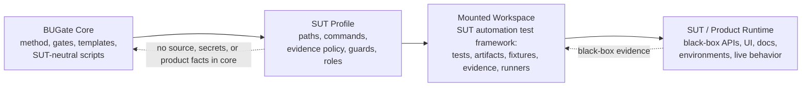

# BUGate

**BUGate** is a SUT-agnostic methodology and gate engine for AI-driven **black-box test development**. It forces an AI agent to build a *verifiable business understanding* of a system under test (SUT) — propositions, oracles, boundaries, states — and to pass review gates **before** any test code is written.

This repository is the reusable **core**. It contains no product tests,
business data, source snapshots, endpoints, credentials, or environment facts.
A **SUT profile** connects the core to a SUT's automation test framework or test
workspace; it does not import the product system into BUGate core.

Positioning, the normative usage model (**imported** = default, **core
workbench** = maintainer), naming, and the evolution plan are chartered in
[`CHARTER.md`](CHARTER.md) (CHARTER-BUGATE-001).

## First 5 minutes (start here)

Zero install (Python 3.9+, standard library only; 3.10+ recommended). From the repo root:

```bash
python3 scripts/check_bugate_v13_semantics.py examples/demo-sut --scope all --require-passed
```

That runs every pre-code gate against a filled, **passing** demo stack (a neutral URL-shortener use case) and prints `PASS`. To watch the physical write-guard **block, then allow** an edit, walk through [`examples/mounted-demo/WALKTHROUGH.md`](examples/mounted-demo/WALKTHROUGH.md).

- **What is BUGate, and how is it meant to be used?** [`CHARTER.md`](CHARTER.md) — positioning, the two usage modes (imported = default, workbench = maintainer), naming, and the evolution plan.
- **Bootstrapping with an AI agent?** [`INIT.md`](INIT.md) is a runnable init prompt (Python check → zero-install smoke → config load → optional capabilities).
- **What can it do / every command?** [`CAPABILITIES.md`](CAPABILITIES.md).
- **Turn on optional runtimes** (AI CLIs, MCP memory service + ONNX, role isolation): [`docs/SETUP-OPTIONAL.md`](docs/SETUP-OPTIONAL.md).
- **The methodology** (why): [`docs/qa-methodology/`](docs/qa-methodology/) — start with its [README](docs/qa-methodology/README.md) (English summary + glossary) then `METHOD.md` / `SOP.md`.

## Usage modes — imported (default) vs core workbench (maintainer)

BUGate is used in exactly one of two ways (normative rules: [`CHARTER.md`](CHARTER.md) §2):

- **Imported mode — the default.** Your agent runtime opens the **SUT automation
  test repo** as the project root, and BUGate is imported into it — skills,
  hooks, gate scripts, and a **committed** profile — as the agent's governance
  layer. The SUT keeps its own test harness, domain skills, and CI; the gate
  checks run in that repo's CI, where the guarded changes actually happen. This
  is the mode to teach, demo, and present.
- **Core workbench mode — maintainers only.** Open *this* repository as the
  project root and mount a SUT test workspace via a symlink and a local,
  uncommitted `profile:` pointer. Reserved for developing BUGate itself:
  debugging core scripts/hooks/skill discovery; evolving the methodology,
  profile schema, or gates; running `examples/` smokes; and cross-SUT
  regression (verifying the core stays clean of any one SUT). It is not the
  user-facing story.

> A first-class installer (`bugate init`) and plugin packaging for imported
> mode are the next milestone (CHARTER §5.2–§5.3). Until they ship, imported
> mode is a manual vendor step (Quickstart A below); the workbench remains the
> fully-scripted path.

## Core/Profile/Mounted Workspace Model

In BUGate terms, "mounting a SUT" means mounting or pointing at the SUT's
automation test framework / test workspace. The product runtime remains a
black-box target observed through tests, docs, contracts, logs, captured
evidence, or other profile-declared sources.



| Part | What it is | Where it lives |
|---|---|---|
| **Core** (this repo) | Methodology + gate engine + templates + agent adapters. Knows nothing about any specific SUT. | here |
| **SUT Profile** (the bridge) | A small declarative file that binds the core to one SUT test workspace's artifact dirs, guarded test globs, commands, evidence policy, roles, and namespace. | profile package or beside the mounted test workspace |
| **Mounted Workspace** | Usually the SUT's automation test framework / test workspace: tests, generated BUGate artifacts, fixtures, runners, captured evidence, and local test rules. | its own repo/workspace |
| **SUT / Product Runtime** | The actual product being tested: black-box API/UI/runtime behavior, production docs/contracts/environments, and optional source or API dumps as evidence. | outside BUGate core |

One core can govern **one** mounted test workspace or **many** (N=1 is just the
degenerate case). The core knows nothing SUT-specific; SUT-aware paths,
commands, auth rules, resource policies, and evidence sources live in the
profile or the mounted test workspace. See
[`docs/qa-methodology/BUGATE_PLATFORM_DECOUPLING_ADR.md`](docs/qa-methodology/BUGATE_PLATFORM_DECOUPLING_ADR.md).

## The gate flow

Test development is gated through layered artifacts; code is blocked until the pre-code artifacts reach `gate_status: passed`:

1. **Layer 1 — Business Brief** (`01_business_brief.md`) — SUT boundary, propositions (`P-xxx`), business oracles (`O-xxx`), boundaries, states, open questions.
2. **Layer 2 — Testability** (`02_testability.md`) — the cheapest valid test layer per proposition, resource strategy, side-effect classification, and deferral decisions.
3. **Layer 3 — Inventory** (`03_inventory.yaml`) — concrete cases bound to propositions + oracles.
4. **Layer 3A / 3B** (`03a_test_cases.md`, `03b_adversarial_cases.yaml`) — human-readable review cases + adversarial/red-team cases.
5. **Layer 4 — Code** — written only after the above pass.

First principles live in [`.shared/skills/bugate/references/sdtd-constitution.md`](.shared/skills/bugate/references/sdtd-constitution.md); the full methodology in [`docs/qa-methodology/METHOD.md`](docs/qa-methodology/METHOD.md) and [`SOP.md`](docs/qa-methodology/SOP.md).

## Quickstart

### A) Imported mode — govern your SUT test repo (default)

Until `bugate init` ships (CHARTER §5.2), import manually. Everything below
lands in the **SUT repo** and is **committed** there — in imported mode the
governance contract is reviewed and versioned with the tests it guards:

1. **Vendor the engine and skill** into the SUT test repo (copy or git
   submodule): `scripts/` (the stdlib-only gate engine) and
   `.shared/skills/bugate/` (the skill tree, discovered via `.claude/skills/` /
   `.codex/skills/` symlinks).
2. **Wire the hooks**: merge the hook blocks from this repo's
   `.claude/settings.json` and `.codex/hooks.json` into the SUT repo's own
   files. Two current constraints, both removed by the CHARTER §5.3
   root-discovery split: hook root discovery walks up for the `AGENTS.md` +
   `.shared/` sentinel, so the SUT repo needs both; and Codex requires a
   one-time re-trust of the changed hook hash.
3. **Create and commit the config + profile** in the SUT repo:

   ```yaml
   # bugate.config.yaml — committed, in the SUT repo
   profile: bugate.profile.yaml
   ```

   ```yaml
   # bugate.profile.yaml — committed, in the SUT repo
   artifact_dir: docs/usecases
   guarded_path_regex:
     - "tests/.*/test_.*[.]py$"
   ```

4. **Gate the CI and verify the negative control**: add the semantic gates to
   the SUT repo's CI, then confirm that editing a guarded test whose use case
   has no passed pre-code artifacts is physically blocked
   (`scripts/check_bugate.py` exits 2).

Daily agent sessions then open the **SUT repo** — not this one — and BUGate
governs from inside it.

### B) Core workbench mode — mount a SUT into this repo (maintainers)

1. Copy the sample profile and point `bugate.config.yaml` at it (or keep `mode: core` for the unmounted engine):

   ```bash
   mkdir -p sut && cp examples/sample-sut.profile.yaml sut/my-sut.profile.yaml
   ```

   ```yaml
   # bugate.config.yaml
   profile: sut/my-sut.profile.yaml
   ```

   > The `profile:` line is a local, per-clone edit — **don't commit it**; BUGate is a generic framework where each clone mounts its own SUT.

2. In the profile, declare the mounted test workspace surfaces (see [`examples/sample-sut.profile.yaml`](examples/sample-sut.profile.yaml) for the full, commented version):

   ```yaml
   artifact_dir: docs/usecases             # where BUGate UC artifacts live in the test workspace
   guarded_path_regex:                     # which test files the write-guard protects
     - "tests/.*/test_.*[.]py$"
   required_precode_artifacts:             # override the default 01–05 set if needed
     - 01_business_brief.md
     - 02_testability.md
     - 03_inventory.yaml
   ```

3. Run a gate:

   ```bash
   python3 scripts/check_bugate.py <test-file-or-patch>      # physical write guard
   python3 scripts/check_bugate_inventory_semantics.py <uc-dir>
   ```

**Workbench physical layout — keep the SUT repo separate, symlink it in.**
Because the mounted workspace is its **own** git repository, don't nest it
physically inside BUGate's working tree — nested independent repos confuse
IDEs, invite an accidental `git add`, and blur the two-repo boundary. Keep the
SUT in its own directory and symlink it under BUGate:

```bash
# SUT lives beside BUGate at ../my-sut (its own repo + remote); mount it in:
ln -s ../my-sut my-sut
# ignore the symlink LOCALLY — no trailing slash, since a symlink is not a
# directory to git — so BUGate's committed tree carries no SUT name:
printf '/my-sut\n' >> .git/info/exclude
```

The symlink is transparent to the gate (`check_bugate.py` matches the textual
path and reads artifacts through the link), while the two repos keep fully
independent histories, remotes, and lifecycles.

The core ships with `guarded_path_regex: []` (write-guard **disabled**) and an
empty `artifact_dir`; a SUT profile turns these on for a mounted test
workspace.

**Worked example.** [`examples/demo-sut/`](examples/demo-sut/) is a filled, passing 01–05 gate stack for a neutral fictional SUT (a URL shortener), including the optional `01a`/`01b`/`02a` modeling artifacts. It doubles as a smoke fixture — the repo's own gates run against it green:

```bash
python3 scripts/check_bugate_v13_semantics.py examples/demo-sut --scope all --require-passed
```

## Agent runtimes

BUGate runs under **Claude Code** and **Codex** via the skill at `.shared/skills/bugate/` and the hooks in `.claude/` / `.codex/` — from this repo in workbench mode, or vendored into the SUT repo in imported mode (Quickstart A). The gate engine is **stdlib-only** (no third-party deps) and resolves the repo root git-free via a sentinel (`AGENTS.md` + `.shared/`). Note: adding or changing a Codex hook requires re-trusting its hash.

Field-tested setup notes: use the vendor native installers for `codex` and
`claude`, not stale npm wrappers; keep `~/.local/bin` ahead of older app or
Homebrew paths; and treat `check-env` as a binary-resolution check, not an auth
check. Real peer dispatch still requires Codex and Claude to be logged in (or
API-key configured). For the memory bus, prefer a project `.venv` and install
the extra runtime packages listed in [`docs/SETUP-OPTIONAL.md`](docs/SETUP-OPTIONAL.md);
`mcp-memory-service` alone may not be enough for ONNX-backed startup.

For a repeatable end-to-end capability audit after setup, invoke the
`$bugate-full-check` skill. Its fallback prompt is documented in
[`INIT.zh-CN.md`](INIT.zh-CN.md).

## Layout

```
bugate.config.yaml          # core config; a SUT profile overrides its values
AGENTS.md                   # agent behavior protocol (SUT-neutral)
CHARTER.md                  # charter: positioning, usage modes (imported vs workbench), evolution plan
scripts/                    # gate engine + SDTD orchestration (stdlib-only)
.shared/skills/bugate/      # the BUGate skill: SKILL.md, references/, templates/, adapters/, integration/
docs/qa-methodology/        # METHOD.md, SOP.md, evolution timeline, decision records
examples/                   # sample SUT profile + a filled, passing demo gate stack
.github/workflows/          # CI: py_compile, semantics gates, de-SUT guard
```

## License

[MIT](LICENSE).
