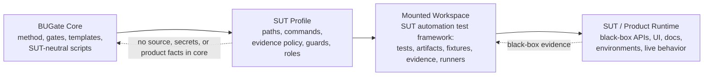

# BUGate

**BUGate** is a SUT-agnostic methodology and gate engine for AI-driven **black-box test development**. It forces an AI agent to build a *verifiable business understanding* of a system under test (SUT) — propositions, oracles, boundaries, states — and to pass review gates **before** any test code is written.

This repository is the reusable **core**. It contains no product tests,
business data, source snapshots, endpoints, credentials, or environment facts.
A **SUT profile** connects the core to a SUT's automation test framework or test
workspace; it does not import the product system into BUGate core.

Positioning, the normative usage model (**imported** is the only usage mode;
opening this repo is just developing BUGate itself), naming, and the
evolution plan are chartered in
[`CHARTER.md`](CHARTER.md) (CHARTER-BUGATE-001).

## First 5 minutes (start here)

Zero install (Python 3.9+, standard library only; 3.10+ recommended). From the repo root:

```bash
python3 scripts/check_bugate_v13_semantics.py .shared/skills/bugate/templates --scope pre-code
python3 tests/test_write_guard_layouts.py
```

The first line runs the pre-code semantic gates over the shipped artifact
templates and prints `PASS`. The second fabricates governed workspaces in a
temp dir and shows the physical write-guard **block, then allow** an edit in
both layouts (imported + engine-development) — the repo ships no
committed example SUT trees. To see exactly what imported mode installs into
your SUT repo: `python3 scripts/bugate_init.py <sut-repo> --dry-run`.

- **What is BUGate, and how is it meant to be used?** [`CHARTER.md`](CHARTER.md) — positioning, the single usage mode (imported), the self-development setup, naming, and the evolution plan.
- **Bootstrapping with an AI agent?** [`INIT.md`](INIT.md) is a runnable init prompt (Python check → zero-install smoke → config load → optional capabilities).
- **What can it do / every command?** [`CAPABILITIES.md`](CAPABILITIES.md).
- **Turn on optional runtimes** (AI CLIs, MCP memory service + ONNX, role isolation): [`docs/SETUP-OPTIONAL.md`](docs/SETUP-OPTIONAL.md).
- **The methodology** (why): [`docs/qa-methodology/`](docs/qa-methodology/) — start with its [README](docs/qa-methodology/README.md) (English summary + glossary) then `METHOD.md` / `SOP.md`.

## Usage — one mode: imported. (Opening this repo = developing BUGate itself.)

BUGate has exactly **one usage mode** (normative rules: [`CHARTER.md`](CHARTER.md)
§2, Amendment A3):

- **Imported mode.** Your agent runtime opens the **SUT automation test repo**
  as the project root, and BUGate is imported into it — skills, hooks, gate
  scripts, and a **committed** profile — as the agent's governance layer. The
  SUT keeps its own test harness, domain skills, and CI; the gate checks run in
  that repo's CI, where the guarded changes actually happen.

Opening *this* repository in Claude Code / Codex is **not a usage mode** — it
is simply **developing BUGate itself** (maintainers): debugging core
scripts/hooks/skill discovery; evolving the methodology, profile schema, or
gates; running the template gates and ephemeral-fixture smokes (`tests/`); and
cross-SUT regression. For debugging against a real SUT, a test workspace can
be mounted via a symlink and a local, uncommitted `profile:` pointer
(Quickstart B below) — a development practice, not a way of *using* BUGate.

> Both imported-mode channels ship in-repo (CHARTER §5.2–§5.3): the
> **installer** — `python3 scripts/bugate_init.py <sut-repo>` — and the
> **Claude Code plugin** (manifest + hooks in `.claude-plugin/`;
> skills/commands resolved from `.shared/` via manifest path fields, gate
> agents via the top-level `agents` symlink — the plugin runtime loads agents
> only from that default directory — and hooks calling the engine via
> `${CLAUDE_PLUGIN_ROOT}`). Hooks from either channel are inert (exit 0)
> wherever no committed `bugate.config.yaml` marks a workspace root. Codex has
> no plugin system — `bugate init` covers that side. Quickstart A below shows
> the installer first, then the manual equivalent.

## Core/Profile/Mounted Workspace Model

In BUGate terms, "mounting a SUT" means mounting or pointing at the SUT's
automation test framework / test workspace. The product runtime remains a
black-box target observed through tests, docs, contracts, logs, captured
evidence, or other profile-declared sources.



| Part | What it is | Where it lives |
|---|---|---|
| **Core** (this repo) | Methodology + gate engine + templates + agent adapters. Knows nothing about any specific SUT. | here |
| **SUT Profile** (the bridge) | A small declarative file that binds the core to one SUT test workspace's artifact dirs, guarded test globs, commands, evidence policy, roles, and namespace. | profile package or beside the mounted test workspace |
| **Mounted Workspace** | Usually the SUT's automation test framework / test workspace: tests, generated BUGate artifacts, fixtures, runners, captured evidence, and local test rules. | its own repo/workspace |
| **SUT / Product Runtime** | The actual product being tested: black-box API/UI/runtime behavior, production docs/contracts/environments, and optional source or API dumps as evidence. | outside BUGate core |

One core can govern **one** mounted test workspace or **many** (N=1 is just the
degenerate case). The core knows nothing SUT-specific; SUT-aware paths,
commands, auth rules, resource policies, and evidence sources live in the
profile or the mounted test workspace. See
[`docs/qa-methodology/BUGATE_PLATFORM_DECOUPLING_ADR.md`](docs/qa-methodology/BUGATE_PLATFORM_DECOUPLING_ADR.md).

## The gate flow

Test development is gated through layered artifacts; code is blocked until the pre-code artifacts reach `gate_status: passed`:

1. **Layer 1 — Business Brief** (`01_business_brief.md`) — SUT boundary, propositions (`P-xxx`), business oracles (`O-xxx`), boundaries, states, open questions.
2. **Layer 2 — Testability** (`02_testability.md`) — the cheapest valid test layer per proposition, resource strategy, side-effect classification, and deferral decisions.
3. **Layer 3 — Inventory** (`03_inventory.yaml`) — concrete cases bound to propositions + oracles.
4. **Layer 3A / 3B** (`03a_test_cases.md`, `03b_adversarial_cases.yaml`) — human-readable review cases + adversarial/red-team cases.
5. **Layer 4 — Code** — written only after the above pass.

First principles live in [`.shared/skills/bugate/references/sdtd-constitution.md`](.shared/skills/bugate/references/sdtd-constitution.md); the full methodology in [`docs/qa-methodology/METHOD.md`](docs/qa-methodology/METHOD.md) and [`SOP.md`](docs/qa-methodology/SOP.md).

## Quickstart

### A) Imported mode — govern your SUT test repo (default)

**Fast path — the installer.** From this repo:

```bash
python3 scripts/bugate_init.py <sut-repo>    # add --dry-run to preview
```

It vendors the kit into `<sut-repo>/.bugate/`, links skill discovery, merges
the hook blocks into the SUT repo's `.claude/settings.json` +
`.codex/hooks.json` (existing hooks preserved), scaffolds a **committed**
`bugate.config.yaml` + `bugate.profile.yaml`, creates `docs/usecases/`, and
prints the acceptance checklist — including the Codex re-trust caveat and the
R4 negative control. Idempotent; re-running refreshes the vendored kit and the
BUGate hook wiring (upgrading an older import's hook shape; the repo's own
hooks are never rewritten).

**Plugin channel (Claude Code).** Install this repo as a plugin: skills,
commands, gate agents, and hooks load via `${CLAUDE_PLUGIN_ROOT}`, and the
hooks are inert in any repo without a committed `bugate.config.yaml`. You still
commit the config + profile in the SUT repo (steps 3–4).

**Manual equivalent** — everything below lands in the **SUT repo** and is
**committed** there; in imported mode the governance contract is reviewed and
versioned with the tests it guards:

1. **Vendor the engine and skill** into the SUT test repo (copy or git
   submodule): `scripts/` (the stdlib-only gate engine) and
   `.shared/skills/bugate/` (the skill tree, discovered via `.claude/skills/` /
   `.codex/skills/` symlinks).
2. **Wire the hooks**: merge the hook blocks from this repo's
   `.claude/settings.json` and `.codex/hooks.json` into the SUT repo's own
   files. The hooks locate the engine by walking up for
   `scripts/bugate_core.py` (the CHARTER §5.3 root-discovery split — the SUT
   repo does **not** need BUGate's `AGENTS.md`/`.shared/` sentinel), and the
   committed `bugate.config.yaml` from step 3 marks the workspace root the
   gates govern. One constraint remains: Codex requires a one-time re-trust of
   the changed hook hash.
3. **Create and commit the config + profile** in the SUT repo:

   ```yaml
   # bugate.config.yaml — committed, in the SUT repo
   profile: bugate.profile.yaml
   ```

   ```yaml
   # bugate.profile.yaml — committed, in the SUT repo
   artifact_dir: docs/usecases
   guarded_path_regex:
     - "tests/.*/test_.*[.]py$"
   ```

4. **Gate the CI and verify the negative control**: add the semantic gates to
   the SUT repo's CI, then confirm that editing a guarded test whose use case
   has no passed pre-code artifacts is physically blocked
   (`scripts/check_bugate.py` exits 2).

Daily agent sessions then open the **SUT repo** — not this one — and BUGate
governs from inside it. The layout is exercised end-to-end in CI on ephemeral
fixtures: [`tests/test_write_guard_layouts.py`](tests/test_write_guard_layouts.py)
plus a `bugate init` scratch-repo run with the R4 negative control.

### B) Developing BUGate itself — optionally mount a SUT for debugging (maintainers)

1. Write a profile under a local `sut/` dir and point `bugate.config.yaml` at it (or keep `mode: core` for the unmounted engine). The full key contract lives in [`profile-schema.md`](.shared/skills/bugate/references/profile-schema.md); `scripts/bugate_init.py` scaffolds the same file shape for imported repos.

   ```yaml
   # bugate.config.yaml
   profile: sut/my-sut.profile.yaml
   ```

   > The `profile:` line is a local, per-clone edit — **don't commit it**; BUGate is a generic framework where each clone mounts its own SUT.

2. In the profile, declare the mounted test workspace surfaces:

   ```yaml
   artifact_dir: docs/usecases             # where BUGate UC artifacts live in the test workspace
   guarded_path_regex:                     # which test files the write-guard protects
     - "tests/.*/test_.*[.]py$"
   required_precode_artifacts:             # override the default 01–05 set if needed
     - 01_business_brief.md
     - 02_testability.md
     - 03_inventory.yaml
   ```

3. Run a gate:

   ```bash
   python3 scripts/check_bugate.py <test-file-or-patch>      # physical write guard
   python3 scripts/check_bugate_inventory_semantics.py <uc-dir>
   ```

**Self-development physical layout — keep the SUT repo separate, symlink it in.**
Because the mounted workspace is its **own** git repository, don't nest it
physically inside BUGate's working tree — nested independent repos confuse
IDEs, invite an accidental `git add`, and blur the two-repo boundary. Keep the
SUT in its own directory and symlink it under BUGate:

```bash
# SUT lives beside BUGate at ../my-sut (its own repo + remote); mount it in:
ln -s ../my-sut my-sut
# ignore the symlink LOCALLY — no trailing slash, since a symlink is not a
# directory to git — so BUGate's committed tree carries no SUT name:
printf '/my-sut\n' >> .git/info/exclude
```

The symlink is transparent to the gate (`check_bugate.py` matches the textual
path and reads artifacts through the link), while the two repos keep fully
independent histories, remotes, and lifecycles.

The core ships with `guarded_path_regex: []` (write-guard **disabled**) and an
empty `artifact_dir`; a SUT profile turns these on for a mounted test
workspace.

**Worked verification.** The repo ships **no committed example SUT trees**
(imported-mode purity): the governed-layout acceptances fabricate their
fixtures at run time — see [`tests/`](tests/) and the CI steps — and the
shipped artifact templates pass the pre-code gates as-is:

```bash
python3 scripts/check_bugate_v13_semantics.py .shared/skills/bugate/templates --scope pre-code
```

## Agent runtimes

BUGate runs under **Claude Code** and **Codex** via the skill at `.shared/skills/bugate/` and the hooks in `.claude/` / `.codex/` — from this repo while developing BUGate itself, vendored into the SUT repo in imported mode (Quickstart A), or as a **Claude Code plugin** (`.claude-plugin/` carries the manifest + hooks; its path fields point skills/commands at `.shared/`, while the gate agents load through the top-level `agents` symlink — the plugin runtime discovers agents only in that default directory, so that one component keeps a top-level entry). The gate engine is **stdlib-only** (no third-party deps) and resolves roots git-free: the governed workspace via the nearest `bugate.config.yaml` up from CWD (`AGENTS.md` + `.shared/` sentinel as the self-development fallback), engine assets via the engine tree's own location. Note: adding or changing a Codex hook requires re-trusting its hash.

Field-tested setup notes: use the vendor native installers for `codex` and
`claude`, not stale npm wrappers; keep `~/.local/bin` ahead of older app or
Homebrew paths; and treat `check-env` as a binary-resolution check, not an auth
check. Real peer dispatch still requires Codex and Claude to be logged in (or
API-key configured). For the memory bus, prefer a project `.venv` and install
the extra runtime packages listed in [`docs/SETUP-OPTIONAL.md`](docs/SETUP-OPTIONAL.md);
`mcp-memory-service` alone may not be enough for ONNX-backed startup.

For a repeatable end-to-end capability audit after setup, invoke the
`$bugate-full-check` skill. Its fallback prompt is documented in
[`INIT.zh-CN.md`](INIT.zh-CN.md).

## Layout

```
bugate.config.yaml          # core config; a SUT profile overrides its values
AGENTS.md                   # agent behavior protocol (SUT-neutral)
CHARTER.md                  # charter: positioning, the single usage mode (imported) + self-development rules, evolution plan
agents -> .shared/…/agents  # gate agents for the plugin runtime (it only loads agents from this default dir)
scripts/                    # gate engine + SDTD orchestration (stdlib-only)
.shared/skills/bugate/      # the BUGate skill: SKILL.md, references/, templates/, adapters/, integration/
docs/qa-methodology/        # METHOD.md, SOP.md, evolution timeline, decision records
docs/case-studies/          # narrative allowlist: real import/migration stories (identity-scan exempt)
tests/                      # upstream-only ephemeral-fixture acceptances (dual-layout write guard, de-SUT meta-test) + legacy term fixture
.github/workflows/          # CI: py_compile, semantics gates, de-SUT guard (hygiene/legacy/second-SUT/meta)
```

## Provenance

BUGate was not designed in the abstract — it was **extracted**. The gate stack
grew up embedded in the automation test workspace of
hypervise, a production multi-chain wallet platform, <!-- bugate: allow-sut-term -->
where "prove your business understanding before you write test code" was first
enforced against a live SUT. The methodology, the fail-closed write guard, the
schema-driven semantic gates, and the falsification waves were all field-tested
there, then de-SUT'd into this neutral core (ADR-BUGATE-001), migrated by the
strangler-fig discipline of
[`TRANSITION_PROTOCOL`](docs/qa-methodology/TRANSITION_PROTOCOL.md), and
finally re-imported into the origin repo in the default imported mode. The
full-circle story — including the real committed profile — is
[`docs/case-studies/origin-sut-import.md`](docs/case-studies/origin-sut-import.md).

The identity mention above is explicitly marked narrative provenance: per
CHARTER Amendment A1, the de-SUT guard blocks *seepage into the reusable kit*,
not *mention in the story*.

## License

[MIT](LICENSE).
