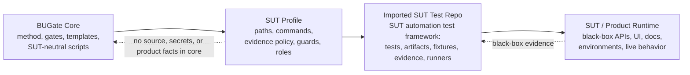

# BUGate

[English](README.md) | [简体中文](README.zh-CN.md)

**BUGate** is a SUT-agnostic methodology and gate engine for AI-driven **black-box test development**. It forces an AI agent to build a *verifiable business understanding* of a system under test (SUT) — propositions, oracles, boundaries, states — and to pass review gates **before** any test code is written.

This repository is the reusable **core**. It contains no product tests,
business data, source snapshots, endpoints, credentials, or environment facts.
A **SUT profile** connects an imported BUGate kit to the SUT automation test
repo that owns the tests; it does not import the product system into BUGate
core.

Positioning, the normative usage model (**imported** is the only usage mode;
opening this repo is just developing BUGate itself), naming, and the
evolution plan are chartered in
[`CHARTER.md`](CHARTER.md) (CHARTER-BUGATE-001).

## First 5 minutes (start here)

Zero install (Python 3.9+, standard library only; 3.10+ recommended). From the repo root:

```bash
python3 scripts/check_bugate_v13_semantics.py .shared/skills/bugate/templates --scope pre-code
python3 tests/test_write_guard_layouts.py
```

The first line runs the pre-code semantic gates over the shipped artifact
templates and prints `PASS`. The second fabricates imported-repo fixtures in a
temp dir and shows the physical write-guard **block, then allow** an edit in
both supported layouts (imported repo + pure engine-development fixture) — the repo ships no
committed example SUT trees. To see exactly what imported mode installs into
your SUT repo: `python3 scripts/bugate_init.py <sut-repo> --dry-run`.

- **What is BUGate, and how is it meant to be used?** [`CHARTER.md`](CHARTER.md) — positioning, the single usage mode (imported), the self-development setup, naming, and the evolution plan.
- **Bootstrapping with an AI agent?** [`INIT.md`](INIT.md) is a runnable init prompt (Python check → zero-install smoke → config load → optional capabilities).
- **Importing BUGate into a SUT repo with an AI agent?** [`IMPORT_PROMPT.md`](IMPORT_PROMPT.md) is a runnable import prompt (release download → installer → Claude/Codex wiring → Memory Bus → profile activation).
- **What can it do / every command?** [`CAPABILITIES.md`](CAPABILITIES.md).
- **The required memory service** (auto-installed by the importer; prose
  shorthand `bugate init` currently means `python3 scripts/bugate_init.py`) and
  the **optional** runtimes (dual-agent AI CLIs, role isolation):
  [`docs/SETUP-OPTIONAL.md`](docs/SETUP-OPTIONAL.md).
- **The methodology** (why): [`docs/qa-methodology/`](docs/qa-methodology/) — start with its [README](docs/qa-methodology/README.md) (English summary + glossary) then `METHOD.md` / `SOP.md`.

## Usage — one mode: imported. (Opening this repo = developing BUGate itself.)

BUGate has exactly **one usage mode** (normative rules: [`CHARTER.md`](CHARTER.md)
§2, Amendment A4):

- **Imported mode.** Your agent runtime opens the **SUT automation test repo**
  as the project root, and BUGate is imported into it — skills, hooks, gate
  scripts, and a **committed** profile — as the agent's governance layer. The
  SUT keeps its own test harness, domain skills, and CI; the gate checks run in
  that repo's CI, where the guarded changes actually happen.

Opening *this* repository in Claude Code / Codex is **not a usage mode** — it
is simply **developing BUGate itself** (maintainers): debugging core
scripts/hooks/skill discovery; evolving the methodology, profile schema, or
gates; running the template gates and ephemeral-fixture smokes (`tests/`); and
cross-SUT regression through imported scratch or external SUT test repos. BUGate
core development stays pure: do not mount a SUT inside this repository.

> The imported-mode channels ship in-repo (CHARTER §5.2–§5.3): the
> **installer** — `python3 scripts/bugate_init.py <sut-repo>` — plus
> **Codex** and **Claude Code** plugin packaging. The installer is still the
> clearest SUT-adoption path because it writes the committed profile,
> project-local hooks, skill links, CI-friendly scripts, and Codex gate-agent
> cards into the SUT repo. The plugin shape is symmetric at the repo root:
> `.codex-plugin/plugin.json` and `.claude-plugin/plugin.json` are manifests;
> `skills/`, `commands/`, `agents/`, `hooks/hooks.json`, `scripts/`, and `bin/`
> carry the shared components. Hooks from either channel are inert (exit 0)
> wherever no committed `bugate.config.yaml` marks a workspace root.
> Quickstart A below shows the installer first, then the plugin/manual
> equivalents.

## Core/Profile/Imported SUT Test Repo Model

In BUGate terms, the active project for real SUT work is the **SUT automation
test repo** that imports BUGate. The product runtime remains a black-box target observed
through tests, docs, contracts, logs, captured evidence, or other
profile-declared sources. It is never placed inside BUGate core.



| Part | What it is | Where it lives |
|---|---|---|
| **Core** (this repo) | Methodology + gate engine + templates + agent adapters. Knows nothing about any specific SUT. | here |
| **SUT Profile** (the bridge) | A small declarative file that binds the imported kit to one SUT test repo's artifact dirs, guarded test globs, commands, evidence policy, roles, and namespace. | committed in the SUT test repo |
| **Imported SUT Test Repo** | The SUT's automation test framework / test workspace: tests, generated BUGate artifacts, fixtures, runners, captured evidence, and local test rules. | its own repo/workspace, opened as project root |
| **SUT / Product Runtime** | The actual product being tested: black-box API/UI/runtime behavior, production docs/contracts/environments, and optional source or API dumps as evidence. | outside BUGate core |

One BUGate core can be imported into **many** SUT test repos. Each imported repo
owns and versions its own profile and evidence rules. The core knows nothing
SUT-specific; SUT-aware paths, commands, auth rules, resource policies, and
evidence sources live in the profile or the imported SUT test repo. See
[`docs/qa-methodology/BUGATE_PLATFORM_DECOUPLING_ADR.md`](docs/qa-methodology/BUGATE_PLATFORM_DECOUPLING_ADR.md).

## The gate flow

Test development is gated through layered artifacts; code is blocked until the pre-code artifacts reach `gate_status: passed`:

1. **Layer 1 — Business Brief** (`01_business_brief.md`) — SUT boundary, propositions (`P-xxx`), business oracles (`O-xxx`), boundaries, states, open questions.
2. **Layer 2 — Testability** (`02_testability.md`) — the cheapest valid test layer per proposition, resource strategy, side-effect classification, and deferral decisions.
3. **Layer 3 — Inventory** (`03_inventory.yaml`) — concrete cases bound to propositions + oracles.
4. **Layer 3A / 3B** (`03a_test_cases.md`, `03b_adversarial_cases.yaml`) — human-readable review cases + adversarial/red-team cases.
5. **Layer 4 — Code** — written only after the above pass.

First principles live in [`.shared/skills/bugate/references/sdtd-constitution.md`](.shared/skills/bugate/references/sdtd-constitution.md); the full methodology in [`docs/qa-methodology/METHOD.md`](docs/qa-methodology/METHOD.md) and [`SOP.md`](docs/qa-methodology/SOP.md).

## Quickstart

### A) Imported mode — govern your SUT test repo (default)

**Agent-assisted import prompt.** Open the SUT automation test repo as the
project root, then paste [`IMPORT_PROMPT.md`](IMPORT_PROMPT.md) into Claude Code
or Codex. The prompt guides the agent through release download, installer
dry-run, import, hook/script wiring checks, Memory Bus initialization, profile
activation, and the Codex re-trust reminder. Chinese mirror:
[`IMPORT_PROMPT.zh-CN.md`](IMPORT_PROMPT.zh-CN.md).

**Release tarball path — no BUGate core clone required in the SUT repo.** Download
the versioned GitHub Release asset, unpack it outside the SUT repo, then run the
installer against the SUT automation test repo:

```bash
BUGATE_VERSION=0.3.3
curl -L -o bugate-${BUGATE_VERSION}.tar.gz \
  https://github.com/ZhangLiangchen/BUGate/releases/download/v${BUGATE_VERSION}/bugate-${BUGATE_VERSION}.tar.gz
tar -xzf bugate-${BUGATE_VERSION}.tar.gz

python3 bugate-${BUGATE_VERSION}/scripts/bugate_init.py /path/to/sut-test-framework --dry-run
python3 bugate-${BUGATE_VERSION}/scripts/bugate_init.py /path/to/sut-test-framework
```

The `.zip` release asset is equivalent for environments where zip archives are
easier to handle; the `.tar.gz` path is preferred because it preserves symlinks
most consistently.

**Source checkout path — useful while developing BUGate itself.** From this repo:

```bash
python3 scripts/bugate_init.py <sut-repo>    # add --dry-run to preview
```

It vendors the kit into `<sut-repo>/.bugate/`, links skill discovery through
`.claude/skills/`, official Codex `.agents/skills/`, and legacy Codex
`.codex/skills/`, merges the hook blocks into the SUT repo's `.claude/settings.json` +
`.codex/hooks.json` (existing hooks preserved), scaffolds a **committed**
`bugate.config.yaml` + `bugate.profile.yaml`, creates `docs/usecases/`, and
prints the acceptance checklist — including the Codex re-trust caveat and the
R4 negative control. Idempotent; re-running refreshes the vendored kit and the
BUGate hook wiring (upgrading an older import's hook shape; the repo's own
hooks are never rewritten).

**Plugin channels (Codex + Claude Code).** Install this repo as a plugin when
you want the reusable runtime surface without vendoring first. Codex uses
`.codex-plugin/plugin.json`; Claude Code uses `.claude-plugin/plugin.json`.
Both load the same plugin-root `skills/` and `hooks/hooks.json`; Claude also
loads `commands/` and `agents/` from the same root. You still commit the
config + profile in the SUT repo (steps 3–4). For Codex project-local gate
agents, run the installer as well so the reviewed TOMLs land in `.codex/agents/`.

**Manual equivalent** — everything below lands in the **SUT repo** and is
**committed** there; in imported mode the governance contract is reviewed and
versioned with the tests it guards:

1. **Vendor the engine and skill** into the SUT test repo (copy or git
   submodule): `scripts/` (the stdlib-only gate engine) and
   `.shared/skills/bugate/` (the skill tree, discovered via `.claude/skills/`
   and Codex `.agents/skills/` symlinks; `.codex/skills/` may remain as a
   compatibility bridge for older Codex clients).
2. **Wire the hooks**: merge the hook blocks from this repo's
   `.claude/settings.json` and `.codex/hooks.json` into the SUT repo's own
   files. The hooks locate the engine by walking up for
   `scripts/bugate_core.py` (the CHARTER §5.3 root-discovery split — the SUT
   repo does **not** need BUGate's `AGENTS.md`/`.shared/` sentinel), and the
   committed `bugate.config.yaml` from step 3 marks the workspace root the
   gates govern. One constraint remains: Codex requires a one-time re-trust of
   the changed hook hash.
3. **Create and commit the config + profile** in the SUT repo:

   ```yaml
   # bugate.config.yaml — committed, in the SUT repo
   profile: bugate.profile.yaml
   ```

   ```yaml
   # bugate.profile.yaml — committed, in the SUT repo
   artifact_dir: docs/usecases
   guarded_path_regex:
     - "tests/.*/test_.*[.]py$"
   ```

4. **Gate the CI and verify the negative control**: add the semantic gates to
   the SUT repo's CI, then confirm that editing a guarded test whose use case
   has no passed pre-code artifacts is physically blocked
   (`scripts/check_bugate.py` exits 2).

Daily agent sessions then open the **SUT repo** — not this one — and BUGate
governs from inside it. The layout is exercised end-to-end in CI on ephemeral
fixtures: [`tests/test_write_guard_layouts.py`](tests/test_write_guard_layouts.py)
plus a `bugate init` scratch-repo run with the R4 negative control.

### B) Developing BUGate itself — pure core iteration (maintainers)

Keep this repository SUT-neutral. Do not add a SUT repo, symlink a SUT repo, or
point this repo's `bugate.config.yaml` at SUT-specific profiles. Core iteration
uses:

```bash
python3 scripts/check_bugate_v13_semantics.py .shared/skills/bugate/templates --scope pre-code
python3 tests/test_write_guard_layouts.py
python3 tests/test_init_scaffold.py
python3 tests/test_hook_surface_parity.py
python3 scripts/check_no_sut_terms.py --terms-file tests/fixtures/legacy-sut-terms.txt
```

When validating real adoption, run `python3 scripts/bugate_init.py <sut-repo>`
against an external SUT test repo or a scratch repo outside BUGate core, then
open that SUT repo as the project root. The core checkout remains pure.

To build Phase 1 GitHub Release archive assets from a clean BUGate checkout:

```bash
python3 scripts/build_release_archives.py --version 0.3.3
```

This writes:

```text
dist/bugate-0.3.3.tar.gz
dist/bugate-0.3.3.zip
```

Attach both files to the GitHub Release for tag `v0.3.3`. These archives include
the Codex and Claude Code plugin surfaces, shared skills, hooks, scripts, and
bin wrappers as one versioned BUGate kit.

The core ships with `guarded_path_regex: []` (write-guard **disabled**) and an
empty `artifact_dir`; an imported SUT profile turns these on in the governed SUT
test repo.

**Worked verification.** The repo ships **no committed example SUT trees**
(imported-mode purity): the governed-layout acceptances fabricate their
fixtures at run time — see [`tests/`](tests/) and the CI steps — and the
shipped artifact templates pass the pre-code gates as-is:

```bash
python3 scripts/check_bugate_v13_semantics.py .shared/skills/bugate/templates --scope pre-code
```

## Support envelope

- **Verified platform: macOS.** Other OSes are not yet validated; adapting the
  kit there (bash wrappers, hook command strings, path handling) is currently
  the adopter's responsibility. Broader OS support is roadmap, not a defect.
- **Agent runtimes: Claude Code and Codex, by design.** The orchestrator, hook
  wiring, and dual-peer bridges target exactly these two; other agents/editors
  get no physical gate wiring today and are future evolution items.
- **Host runtime vs SUT language:** the kit itself needs `python3 >= 3.9` on
  the machine (stdlib-only). Your test framework does **not** have to be
  Python — the write guard, artifact gates, and orchestrator are
  language-agnostic (validated on pytest, TypeScript/Playwright specs,
  Java/JUnit CamelCase tests, and Cucumber `.feature` trees). Layer-4
  post-run log classification is currently tuned for pytest-shaped output.

## Agent runtimes

BUGate runs under **Claude Code** and **Codex** via the shared skill at
`.shared/skills/bugate/` and the hooks in `.claude/` / `.codex/` — from this
repo while developing BUGate itself, vendored into the SUT repo in imported
mode (Quickstart A), or through the dual plugin surface. Codex repo skills use
`.agents/skills/` as the canonical path; `.codex/skills/` is retained only as a
legacy bridge. Plugin packaging is root-standard: manifests live under
`.codex-plugin/` and `.claude-plugin/`; `skills/`, `commands/`, `agents/`,
`hooks/hooks.json`, `scripts/`, and `bin/` stay at the plugin root. The gate
engine is **stdlib-only** (no third-party deps) and resolves roots git-free:
the active project via the nearest `bugate.config.yaml` up from CWD
(`AGENTS.md` + `.shared/` sentinel as the self-development fallback), engine
assets via the engine tree's own location. Note: adding or changing a Codex
hook requires re-trusting its hash, and plugin changes may require
Claude's `/reload-plugins` or a plugin reinstall/update.

BUGate intentionally ships **no default `.mcp.json`** today: the Memory Bus is a
**required but machine-level** `mcp-memory-service` (auto-installed by `bugate
init` / `bin/memory-bus-*`) plus stdlib client scripts — required as a component,
but shared per machine, so it is **not** a per-repo plugin MCP server. If BUGate later adds a real MCP server contract, the
file should live at plugin root as `.mcp.json` and be referenced by both runtime
manifests.

Field-tested setup notes: use the vendor native installers for `codex` and
`claude`, not stale npm wrappers; keep `~/.local/bin` ahead of older app or
Homebrew paths; and treat `check-env` as a binary-resolution check, not an auth
check. Real peer dispatch still requires Codex and Claude to be logged in (or
API-key configured). The memory bus auto-installs into a machine-level venv
(`~/.bugate/venv`, with `mcp-memory-service` + the ONNX runtime packages); for a
manual/offline install or the exact package set, see
[`docs/SETUP-OPTIONAL.md`](docs/SETUP-OPTIONAL.md) (`mcp-memory-service` alone may
not be enough for ONNX-backed startup).

For a repeatable end-to-end capability audit after setup, invoke the
`$bugate-full-check` skill. Its fallback prompt is documented in
[`INIT.md`](INIT.md) ("Full-capability self-check"; Chinese mirror in
[`INIT.zh-CN.md`](INIT.zh-CN.md)).

## Layout

```
bugate.config.yaml          # core config; a SUT profile overrides its values
AGENTS.md                   # agent behavior protocol (SUT-neutral)
CHARTER.md                  # charter: positioning, the single usage mode (imported) + self-development rules, evolution plan
.agents/skills/             # official Codex repo-skill discovery symlinks
.codex-plugin/plugin.json   # Codex plugin manifest
.claude-plugin/plugin.json  # Claude Code plugin manifest
skills/                     # plugin-root skill symlinks shared by Codex + Claude
commands/                   # plugin-root Claude command adapters
agents -> .shared/…/agents  # plugin-root Claude gate agents
hooks/hooks.json            # plugin-root lifecycle hooks for Codex + Claude
.mcp.json                   # absent by default; add only for a real MCP server contract
.claude/ .codex/            # per-runtime dev bridges: settings/hooks + skill & gate-agent links
scripts/                    # gate engine + SDTD orchestration (stdlib-only)
bin/                        # bash wrappers: memory-bus-* (required, auto-install/self-heal), memory-service-*, wave8-weekly
.shared/skills/bugate/      # the BUGate skill: SKILL.md, references/, templates/, adapters/, integration/
docs/qa-methodology/        # METHOD.md, SOP.md, evolution timeline, decision records
docs/case-studies/          # narrative allowlist: real import/migration stories (identity-scan exempt)
tests/                      # upstream-only ephemeral-fixture acceptances (dual-layout write guard, de-SUT meta-test) + legacy term fixture
.github/workflows/          # CI: py_compile, semantics gates, de-SUT guard (hygiene/legacy/second-SUT/meta)
```

## License

[MIT](LICENSE).
