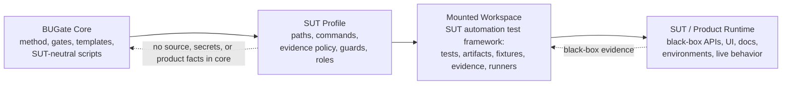

# BUGate

**BUGate** is a SUT-agnostic methodology and gate engine for AI-driven **black-box test development**. It forces an AI agent to build a *verifiable business understanding* of a system under test (SUT) — propositions, oracles, boundaries, states — and to pass review gates **before** any test code is written.

This repository is the reusable **core**. It contains no product tests,
business data, source snapshots, endpoints, credentials, or environment facts.
A **SUT profile** connects the core to a SUT's automation test framework or test
workspace; it does not import the product system into BUGate core.

## First 5 minutes (start here)

Zero install (Python 3.9+, standard library only; 3.10+ recommended). From the repo root:

```bash
python3 scripts/check_bugate_v13_semantics.py examples/demo-sut --scope all --require-passed
```

That runs every pre-code gate against a filled, **passing** demo stack (a neutral URL-shortener use case) and prints `PASS`. To watch the physical write-guard **block, then allow** an edit, walk through [`examples/mounted-demo/WALKTHROUGH.md`](examples/mounted-demo/WALKTHROUGH.md).

- **Bootstrapping with an AI agent?** [`INIT.md`](INIT.md) is a runnable init prompt (Python check → zero-install smoke → config load → optional capabilities).
- **What can it do / every command?** [`CAPABILITIES.md`](CAPABILITIES.md).
- **Turn on optional runtimes** (AI CLIs, MCP memory service + ONNX, role isolation): [`docs/SETUP-OPTIONAL.md`](docs/SETUP-OPTIONAL.md).
- **The methodology** (why): [`docs/qa-methodology/`](docs/qa-methodology/) — start with its [README](docs/qa-methodology/README.md) (English summary + glossary) then `METHOD.md` / `SOP.md`.

## Core/Profile/Mounted Workspace Model

In BUGate terms, "mounting a SUT" means mounting or pointing at the SUT's
automation test framework / test workspace. The product runtime remains a
black-box target observed through tests, docs, contracts, logs, captured
evidence, or other profile-declared sources.



| Part | What it is | Where it lives |
|---|---|---|
| **Core** (this repo) | Methodology + gate engine + templates + agent adapters. Knows nothing about any specific SUT. | here |
| **SUT Profile** (the bridge) | A small declarative file that binds the core to one SUT test workspace's artifact dirs, guarded test globs, commands, evidence policy, roles, and namespace. | profile package or beside the mounted test workspace |
| **Mounted Workspace** | Usually the SUT's automation test framework / test workspace: tests, generated BUGate artifacts, fixtures, runners, captured evidence, and local test rules. | its own repo/workspace |
| **SUT / Product Runtime** | The actual product being tested: black-box API/UI/runtime behavior, production docs/contracts/environments, and optional source or API dumps as evidence. | outside BUGate core |

One core can govern **one** mounted test workspace or **many** (N=1 is just the
degenerate case). The core knows nothing SUT-specific; SUT-aware paths,
commands, auth rules, resource policies, and evidence sources live in the
profile or the mounted test workspace. See
[`docs/qa-methodology/BUGATE_PLATFORM_DECOUPLING_ADR.md`](docs/qa-methodology/BUGATE_PLATFORM_DECOUPLING_ADR.md).

## The gate flow

Test development is gated through layered artifacts; code is blocked until the pre-code artifacts reach `gate_status: passed`:

1. **Layer 1 — Business Brief** (`01_business_brief.md`) — SUT boundary, propositions (`P-xxx`), business oracles (`O-xxx`), boundaries, states, open questions.
2. **Layer 2 — Testability** (`02_testability.md`) — the cheapest valid test layer per proposition, resource strategy, side-effect classification, and deferral decisions.
3. **Layer 3 — Inventory** (`03_inventory.yaml`) — concrete cases bound to propositions + oracles.
4. **Layer 3A / 3B** (`03a_test_cases.md`, `03b_adversarial_cases.yaml`) — human-readable review cases + adversarial/red-team cases.
5. **Layer 4 — Code** — written only after the above pass.

First principles live in [`.shared/skills/bugate/references/sdtd-constitution.md`](.shared/skills/bugate/references/sdtd-constitution.md); the full methodology in [`docs/qa-methodology/METHOD.md`](docs/qa-methodology/METHOD.md) and [`SOP.md`](docs/qa-methodology/SOP.md).

## Quickstart — mount a SUT test workspace

1. Copy the sample profile and point `bugate.config.yaml` at it (or keep `mode: core` for the unmounted engine):

   ```bash
   mkdir -p sut && cp examples/sample-sut.profile.yaml sut/my-sut.profile.yaml
   ```

   ```yaml
   # bugate.config.yaml
   profile: sut/my-sut.profile.yaml
   ```

2. In the profile, declare the mounted test workspace surfaces (see [`examples/sample-sut.profile.yaml`](examples/sample-sut.profile.yaml) for the full, commented version):

   ```yaml
   artifact_dir: docs/usecases             # where BUGate UC artifacts live in the test workspace
   guarded_path_regex:                     # which test files the write-guard protects
     - "tests/.*/test_.*[.]py$"
   required_precode_artifacts:             # override the default 01–05 set if needed
     - 01_business_brief.md
     - 02_testability.md
     - 03_inventory.yaml
   ```

3. Run a gate:

   ```bash
   python3 scripts/check_bugate.py <test-file-or-patch>      # physical write guard
   python3 scripts/check_bugate_inventory_semantics.py <uc-dir>
   ```

The core ships with `guarded_path_regex: []` (write-guard **disabled**) and an
empty `artifact_dir`; a SUT profile turns these on for a mounted test
workspace.

**Worked example.** [`examples/demo-sut/`](examples/demo-sut/) is a filled, passing 01–05 gate stack for a neutral fictional SUT (a URL shortener), including the optional `01a`/`01b`/`02a` modeling artifacts. It doubles as a smoke fixture — the repo's own gates run against it green:

```bash
python3 scripts/check_bugate_v13_semantics.py examples/demo-sut --scope all --require-passed
```

## Agent runtimes

BUGate runs under **Claude Code** and **Codex** via the skill at `.shared/skills/bugate/` and the hooks in `.claude/` / `.codex/`. The gate engine is **stdlib-only** (no third-party deps) and resolves the repo root git-free via a sentinel (`AGENTS.md` + `.shared/`). Note: adding or changing a Codex hook requires re-trusting its hash.

Field-tested setup notes: use the vendor native installers for `codex` and
`claude`, not stale npm wrappers; keep `~/.local/bin` ahead of older app or
Homebrew paths; and treat `check-env` as a binary-resolution check, not an auth
check. Real peer dispatch still requires Codex and Claude to be logged in (or
API-key configured). For the memory bus, prefer a project `.venv` and install
the extra runtime packages listed in [`docs/SETUP-OPTIONAL.md`](docs/SETUP-OPTIONAL.md);
`mcp-memory-service` alone may not be enough for ONNX-backed startup.

For a repeatable end-to-end capability audit after setup, invoke the
`$bugate-full-check` skill. Its fallback prompt is documented in
[`INIT.zh-CN.md`](INIT.zh-CN.md).

## Layout

```
bugate.config.yaml          # core config; a SUT profile overrides its values
AGENTS.md                   # agent behavior protocol (SUT-neutral)
scripts/                    # gate engine + SDTD orchestration (stdlib-only)
.shared/skills/bugate/      # the BUGate skill: SKILL.md, references/, templates/, adapters/, integration/
docs/qa-methodology/        # METHOD.md, SOP.md, evolution timeline, decision records
examples/                   # sample SUT profile + a filled, passing demo gate stack
.github/workflows/          # CI: py_compile, semantics gates, de-SUT guard
```

## License

[MIT](LICENSE).
