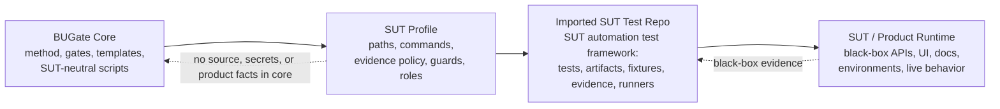

# BUGate

[English](README.md) | [简体中文](README.zh-CN.md)

**BUGate** 是一个与 SUT 无关的方法论与门引擎，用于 AI 驱动的**黑盒测试开发**。它要求 AI agent 在写任何测试代码之前，先建立可验证的业务理解：命题、oracle、边界、状态，并通过评审门。

本仓库是可复用的 **core**。这里不保存产品测试、业务数据、源码快照、接口地址、凭据或环境事实。**SUT profile** 把导入后的 BUGate kit 连接到真正拥有测试的 SUT 自动化测试仓；它不会把产品系统导入 BUGate core。

BUGate 的定位、唯一规范使用方式（**导入模式**；打开本仓只是在开发 BUGate 本身）、命名与演进计划见 [`CHARTER.md`](CHARTER.md)（CHARTER-BUGATE-001）。

## 前 5 分钟（从这里开始）

已经把 BUGate 导入 SUT 仓、想知道日常怎么**用**？导入后的全部指导整合在
**一个 vendored 技能**之下：
[.shared/skills/bugate-import/](.shared/skills/bugate-import/SKILL.md)——
SKILL.md 是适配原则 + 布局接线,操作者手册在
[references/using-bugate.zh-CN.md](.shared/skills/bugate-import/references/using-bugate.zh-CN.md)
（English: 同目录 using-bugate.md）,运维经验在
[references/field-guide.md](.shared/skills/bugate-import/references/field-guide.md)。
它随 kit 进入每个受治理仓,并通过 skill 链接被 agent 自动发现。

零安装（Python 3.9+，只用标准库；推荐 3.10+）。在仓库根目录执行：

```bash
python3 scripts/check_bugate_v13_semantics.py .shared/skills/bugate/templates --scope pre-code
python3 tests/test_write_guard_layouts.py
```

第一行对随仓模板运行 pre-code 语义门并打印 `PASS`。第二行在临时目录中构造导入仓 fixture，验证物理写守卫在两种支持布局中都能**先阻断、再放行**一次编辑（导入仓 + 纯 engine 开发 fixture）—— 本仓不会提交示例 SUT 树。要查看导入模式会向你的 SUT 仓安装哪些内容：

```bash
python3 scripts/bugate_init.py <sut-repo> --dry-run
```

- **BUGate 是什么，应该如何使用？** [`CHARTER.md`](CHARTER.md) —— 定位、唯一使用模式（导入）、自开发设置、命名与演进计划。
- **要用 AI agent 启动？** [`INIT.md`](INIT.md) / [`INIT.zh-CN.md`](INIT.zh-CN.md) 是可直接粘贴给 agent 的初始化 prompt。
- **要让 AI agent 把 BUGate 导入 SUT 仓？** [`IMPORT_PROMPT.md`](IMPORT_PROMPT.md) / [`IMPORT_PROMPT.zh-CN.md`](IMPORT_PROMPT.zh-CN.md) 是可执行导入 prompt（release 下载 → installer → Claude/Codex 接线 → Memory Bus → profile 激活）。
- **能做什么 / 全部命令？** [`CAPABILITIES.md`](CAPABILITIES.md)。
- **必要的 Memory Service**（由 importer 自动安装；文档里的 `bugate init`
  shorthand 当前指 `python3 scripts/bugate_init.py`）与**可选**运行时（双 agent
  AI CLI、角色隔离）：[`docs/SETUP-OPTIONAL.md`](docs/SETUP-OPTIONAL.md)。
- **方法论**（为什么这样做）：[`docs/qa-methodology/`](docs/qa-methodology/) —— 先读其中的 [README](docs/qa-methodology/README.md)（英文摘要 + 术语表），再读 `METHOD.md` / `SOP.md`。

## 使用方式 —— 只有一种：导入模式。（打开本仓 = 开发 BUGate 本身。）

BUGate 只有一种规范使用方式（规则见 [`CHARTER.md`](CHARTER.md) §2 与修正案 A4）：

- **导入模式。** 你的 agent runtime 打开 **SUT 自动化测试仓**作为项目根，并把 BUGate 导入其中：skills、hooks、gate scripts、以及一个**提交到 SUT 仓的** profile。SUT 保留自己的测试框架、领域 skill 和 CI；门检查在那个仓的 CI 中运行，因为被保护的测试改动也发生在那里。

在 Claude Code / Codex 中打开**本仓**不是使用模式，而只是**开发 BUGate 本身**（维护者）：调试 core scripts/hooks/skill 发现；演进方法论、profile schema 或 gates；运行模板门和临时 fixture smoke（`tests/`）；通过外部或 scratch SUT 测试仓做跨 SUT 回归。BUGate core 开发必须保持纯净：不要把 SUT 挂载进本仓。

> 导入模式通道随仓发布（CHARTER §5.2–§5.3）：**installer** —— `python3 scripts/bugate_init.py <sut-repo>` —— 以及 **Codex** / **Claude Code** plugin packaging。installer 仍是最清晰的 SUT 接入路径，因为它会把 committed profile、project-local hooks、skill links、CI-friendly scripts 与 Codex gate-agent cards 写入 SUT 仓。plugin 形态在 repo root 对称：`.codex-plugin/plugin.json` 与 `.claude-plugin/plugin.json` 是 manifest；`skills/`、`commands/`、`agents/`、`hooks/hooks.json`、`scripts/`、`bin/` 承载共享组件。没有 committed `bugate.config.yaml` 标记工作区根时，两端 hooks 都是惰性的（exit 0）。下面 Quickstart A 先展示 installer，再列出 plugin / manual 等价路径。

## Core / Profile / 导入后的 SUT 测试仓模型

在 BUGate 语义中，真实 SUT 工作的活动项目是**导入 BUGate 的 SUT 自动化测试仓**。产品运行时仍是通过测试、文档、契约、日志、证据快照或其他 profile 声明来源观察到的黑盒目标。它永远不放进 BUGate core。



| 部分 | 含义 | 所在位置 |
|---|---|---|
| **Core**（本仓） | 方法论 + 门引擎 + 模板 + agent adapter。不了解任何具体 SUT。 | 本仓 |
| **SUT Profile**（桥） | 一个小型声明式文件，把导入后的 kit 绑定到某个 SUT 测试仓的 artifact 目录、受保护测试 glob、命令、证据策略、角色与 namespace。 | 提交在 SUT 测试仓 |
| **导入后的 SUT 测试仓** | SUT 的自动化测试框架 / 测试工作区：测试、BUGate artifact、fixture、runner、证据与本地测试规则。 | 独立 repo / workspace，作为项目根打开 |
| **SUT / Product Runtime** | 被测产品本身：黑盒 API/UI/runtime 行为、产品文档/契约/环境，以及作为证据的可选源码或 API dump。 | BUGate core 之外 |

一个 BUGate core 可以导入到**多个** SUT 测试仓。每个导入仓拥有并版本化自己的 profile 与证据规则。core 不知道任何 SUT-specific 信息；SUT-aware 路径、命令、认证规则、资源策略和证据来源都放在 profile 或导入后的 SUT 测试仓中。见 [`docs/qa-methodology/BUGATE_PLATFORM_DECOUPLING_ADR.md`](docs/qa-methodology/BUGATE_PLATFORM_DECOUPLING_ADR.md)。

## 门流程

测试开发由分层 artifact 管控；pre-code artifact 达到 `gate_status: passed` 之前，代码会被阻断：

1. **Layer 1 — Business Brief** (`01_business_brief.md`)：SUT 边界、命题（`P-xxx`）、业务 oracle（`O-xxx`）、边界、状态、开放问题。
2. **Layer 2 — Testability** (`02_testability.md`)：每个命题的最低成本有效测试层、资源策略、副作用分类与延期决策。
3. **Layer 3 — Inventory** (`03_inventory.yaml`)：绑定命题 + oracle 的具体用例。
4. **Layer 3A / 3B** (`03a_test_cases.md`, `03b_adversarial_cases.yaml`)：可读评审用例 + 对抗/红队用例。
5. **Layer 4 — Code**：只有前面各层通过后才写测试代码。

第一性原则见 [`.shared/skills/bugate/references/sdtd-constitution.md`](.shared/skills/bugate/references/sdtd-constitution.md)；完整方法论见 [`docs/qa-methodology/METHOD.md`](docs/qa-methodology/METHOD.md) 与 [`SOP.md`](docs/qa-methodology/SOP.md)。

## Quickstart

### A) 导入模式 —— 治理你的 SUT 测试仓（默认）

**Agent 辅助导入 prompt。** 把 SUT 自动化测试仓作为项目根打开，然后把
[`IMPORT_PROMPT.zh-CN.md`](IMPORT_PROMPT.zh-CN.md) 粘给 Claude Code 或
Codex。该 prompt 会指导 agent 完成 release 下载、installer dry-run、正式导入、
hook/script 接线检查、Memory Bus 初始化、profile 激活以及 Codex re-trust
提醒。英文版见 [`IMPORT_PROMPT.md`](IMPORT_PROMPT.md)。

**Release tarball 路径 —— SUT 仓内无需 clone BUGate core。** 下载版本化 GitHub Release asset，在 SUT 仓外解包，然后把 installer 指向 SUT 自动化测试仓：

```bash
BUGATE_VERSION=0.3.3
curl -L -o bugate-${BUGATE_VERSION}.tar.gz \
  https://github.com/ZhangLiangchen/BUGate/releases/download/v${BUGATE_VERSION}/bugate-${BUGATE_VERSION}.tar.gz
tar -xzf bugate-${BUGATE_VERSION}.tar.gz

python3 bugate-${BUGATE_VERSION}/scripts/bugate_init.py /path/to/sut-test-framework --dry-run
python3 bugate-${BUGATE_VERSION}/scripts/bugate_init.py /path/to/sut-test-framework
```

`.zip` release asset 在更适合 zip 的环境中等价可用；优先推荐 `.tar.gz`，因为它通常更稳定地保留 symlink。

**Source checkout 路径 —— 适合开发 BUGate 本身时使用。** 在本仓执行：

```bash
python3 scripts/bugate_init.py <sut-repo>    # 加 --dry-run 可预览
```

installer 会把 kit vendor 到 `<sut-repo>/.bugate/`，通过 `.claude/skills/`、官方 Codex `.agents/skills/` 和 legacy Codex `.codex/skills/` 链接 skill discovery，合并 hook block 到 SUT 仓的 `.claude/settings.json` + `.codex/hooks.json`（保留已有 hooks），生成并提交用的 `bugate.config.yaml` + `bugate.profile.yaml`，创建 `docs/usecases/`，并打印验收清单，包括 Codex re-trust 提醒与 R4 negative control。重复运行是幂等的；再次运行会刷新 vendored kit 和 BUGate hook wiring（升级旧导入形态的 hook 结构；不会改写仓库自己的 hooks）。

**Plugin 通道（Codex + Claude Code）。** 当你想先获得可复用 runtime surface，而不是先 vendor 时，可以把本仓安装为 plugin。Codex 使用 `.codex-plugin/plugin.json`；Claude Code 使用 `.claude-plugin/plugin.json`。两端加载同一个 plugin-root `skills/` 与 `hooks/hooks.json`；Claude 还会从同一 root 加载 `commands/` 与 `agents/`。SUT 仓仍然需要提交 config + profile（步骤 3–4）。若需要 Codex project-local gate agents，也运行 installer，让评审过的 TOML 落到 `.codex/agents/`。

**手工等价路径** —— 下面所有内容都落在 **SUT 仓**并**提交**；导入模式中，治理契约要和它保护的测试一起被 review 和 version：

1. **Vendor engine 和 skill** 到 SUT 测试仓（复制或 git submodule）：`scripts/`（stdlib-only gate engine）和 `.shared/skills/bugate/`（skill tree，通过 `.claude/skills/` 与 Codex `.agents/skills/` symlink 发现；`.codex/skills/` 可作为旧 Codex 兼容桥保留）。
2. **接线 hooks**：把本仓 `.claude/settings.json` 与 `.codex/hooks.json` 的 hook blocks 合并到 SUT 仓自己的文件中。hooks 通过向上查找 `scripts/bugate_core.py` 定位 engine（CHARTER §5.3 root-discovery split —— SUT 仓不需要 BUGate 的 `AGENTS.md` / `.shared/` sentinel），步骤 3 中 committed `bugate.config.yaml` 标记 gates 要治理的工作区根。仍有一个约束：Codex 需要对变化后的 hook hash 做一次 re-trust。
3. **在 SUT 仓创建并提交 config + profile**：

   ```yaml
   # bugate.config.yaml — committed, in the SUT repo
   profile: bugate.profile.yaml
   ```

   ```yaml
   # bugate.profile.yaml — committed, in the SUT repo
   artifact_dir: docs/usecases
   guarded_path_regex:
     - "tests/.*/test_.*[.]py$"
   ```

4. **接入 CI 并验证 negative control**：把语义门加入 SUT 仓 CI，然后确认在没有通过 pre-code artifact 的 use case 下编辑受保护测试会被物理阻断（`scripts/check_bugate.py` 退出 2）。

日常 agent session 打开的随后是 **SUT 仓**，不是本仓。该布局通过 CI 中的临时 fixture 端到端验证：[`tests/test_write_guard_layouts.py`](tests/test_write_guard_layouts.py) 加一次带 R4 negative control 的 `bugate init` scratch-repo run。

### B) 开发 BUGate 本身 —— 纯 core 迭代（维护者）

保持本仓 SUT-neutral。不要加入 SUT repo、symlink SUT repo，或把本仓 `bugate.config.yaml` 指向 SUT-specific profile。core 迭代使用：

```bash
python3 scripts/check_bugate_v13_semantics.py .shared/skills/bugate/templates --scope pre-code
python3 tests/test_write_guard_layouts.py
python3 tests/test_init_scaffold.py
python3 tests/test_hook_surface_parity.py
python3 scripts/check_no_sut_terms.py --terms-file tests/fixtures/legacy-sut-terms.txt
```

验证真实接入时，对外部 SUT 测试仓或 BUGate core 之外的 scratch repo 运行 `python3 scripts/bugate_init.py <sut-repo>`，然后把那个 SUT 仓作为项目根打开。core checkout 仍保持纯净。

从干净 BUGate checkout 构建 Phase 1 GitHub Release archive assets：

```bash
python3 scripts/build_release_archives.py --version 0.3.3
```

输出：

```text
dist/bugate-0.3.3.tar.gz
dist/bugate-0.3.3.zip
```

把两个文件都附到 tag `v0.3.3` 的 GitHub Release。这些归档以一个版本化 BUGate kit 的形式包含 Codex 与 Claude Code plugin surfaces、shared skills、hooks、scripts 与 bin wrappers。

core 默认带 `guarded_path_regex: []`（写守卫**关闭**）和空 `artifact_dir`；导入后的 SUT profile 会在被治理 SUT 测试仓中开启它们。

**已验证的行为。** 本仓不会提交任何示例 SUT 树（保持导入模式纯净）：governed-layout acceptance 在运行时构造 fixture —— 见 [`tests/`](tests/) 与 CI 步骤 —— 随仓 artifact 模板可直接通过 pre-code gates：

```bash
python3 scripts/check_bugate_v13_semantics.py .shared/skills/bugate/templates --scope pre-code
```

## 支持范围（Support envelope）

- **已验证平台：macOS。** 其他操作系统未经验证,兼容适配(bash 包装脚本、hook
  命令串、路径处理)目前由使用方自行负责;更广的 OS 支持属于后续演进,不视为缺陷。
- **Agent 运行时:Claude Code 与 Codex,设计如此。** orchestrator、hook 接线与
  双端评审桥只面向这两家;其他 agent/编辑器目前没有物理门接线,属于未来演进项。
- **宿主运行时 ≠ SUT 语言:** kit 本身需要机器上有 `python3 >= 3.9`(纯标准库),
  但你的测试框架**不必**是 Python——写守卫、工件门与 orchestrator 均与语言无关
  (已在 pytest、TypeScript/Playwright、Java/JUnit 驼峰命名、Cucumber `.feature`
  资产树上实证)。Layer-4 post-run 日志分类目前面向 pytest 形态输出调校。

## Agent runtimes

BUGate 通过 `.shared/skills/bugate/` 的共享 skill 与 `.claude/` / `.codex/` 中的 hooks 运行在 **Claude Code** 与 **Codex** 下：开发 BUGate 本身时来自本仓；导入模式下 vendor 到 SUT 仓（Quickstart A）；也可通过双 plugin surface 使用。Codex repo skills 使用 `.agents/skills/` 作为 canonical 路径；`.codex/skills/` 只保留为 legacy bridge。Plugin packaging 遵循 root-standard：manifest 位于 `.codex-plugin/` 与 `.claude-plugin/`；`skills/`、`commands/`、`agents/`、`hooks/hooks.json`、`scripts/` 与 `bin/` 保持在 plugin root。gate engine **只使用标准库**，并且不依赖 git 来解析 root：active project 通过从 CWD 向上寻找最近的 `bugate.config.yaml` 定位（`AGENTS.md` + `.shared/` sentinel 只作为自开发 fallback），engine assets 通过 engine tree 自身位置定位。注意：新增或修改 Codex hook 需要重新信任其 hash；plugin 改动可能需要 Claude `/reload-plugins` 或重新安装/更新 plugin。

BUGate 目前刻意**不发布默认 `.mcp.json`**：Memory Bus 是一个**必要但机器级**的 `mcp-memory-service`（由 `bugate init` / `bin/memory-bus-*` 自动安装）加 stdlib client scripts。它是必要组件，但按机器共享，因此不是 per-repo plugin MCP server。如果将来 BUGate 增加真正的 MCP server contract，`.mcp.json` 应放在 plugin root，并由两个 runtime manifest 引用。

现场验证过的安装注意事项：使用 `codex` 与 `claude` 的 vendor native installer，不要用过时 npm wrapper；让 `~/.local/bin` 排在旧 app 或 Homebrew 路径之前；把 `check-env` 当作 binary-resolution check，而不是 auth check。真实 peer dispatch 仍要求 Codex 和 Claude 已登录（或配置 API key）。Memory Bus 会自动安装到机器级 venv（`~/.bugate/venv`，包含 `mcp-memory-service` 与 ONNX runtime packages）；手工/离线安装或精确包列表见 [`docs/SETUP-OPTIONAL.md`](docs/SETUP-OPTIONAL.md)（仅 `mcp-memory-service` 可能不足以启动 ONNX-backed 服务）。

安装后要做可重复的端到端能力审计，调用 `$bugate-full-check` skill。其 fallback prompt 记录在 [`INIT.md`](INIT.md)（中文镜像 [`INIT.zh-CN.md`](INIT.zh-CN.md) 的 “Full-capability self-check”）。

## Layout

```text
bugate.config.yaml          # core config；SUT profile 覆盖其值
AGENTS.md                   # agent 行为协议（SUT-neutral）
CHARTER.md                  # charter：定位、唯一使用模式（导入）+ 自开发规则、演进计划
.agents/skills/             # 官方 Codex repo-skill discovery symlinks
.codex-plugin/plugin.json   # Codex plugin manifest
.claude-plugin/plugin.json  # Claude Code plugin manifest
skills/                     # Codex + Claude 共享的 plugin-root skill symlinks
commands/                   # plugin-root Claude command adapters
agents -> .shared/…/agents  # plugin-root Claude gate agents
hooks/hooks.json            # Codex + Claude plugin-root lifecycle hooks
.mcp.json                   # 默认不存在；只有真实 MCP server contract 才添加
.claude/ .codex/            # 每个 runtime 的开发桥：settings/hooks + skill 和 gate-agent links
scripts/                    # gate engine + SDTD orchestration（stdlib-only）
bin/                        # bash wrappers：memory-bus-*（必要，自动安装/自愈）、memory-service-*、wave8-weekly
.shared/skills/bugate/      # BUGate skill：SKILL.md、references/、templates/、adapters/、integration/
docs/qa-methodology/        # METHOD.md、SOP.md、演进 timeline、decision records
docs/case-studies/          # narrative allowlist：真实导入/迁移故事（identity-scan exempt）
tests/                      # upstream-only 临时 fixture acceptance（dual-layout write guard、de-SUT meta-test）+ legacy term fixture
.github/workflows/          # CI：py_compile、semantics gates、de-SUT guard（hygiene/legacy/second-SUT/meta）
```

## License

[MIT](LICENSE).
