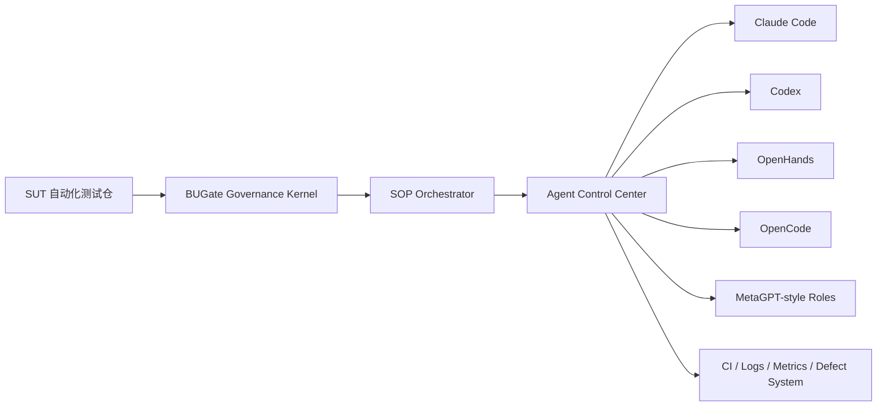

# BUGate Agentic QA Platform 工作指引

本文是 BUGate 接下来演进为企业内 Agentic QA Platform 的工作指引。
它不替代 `CHARTER.md`、`METHOD.md`、`SOP.md`；它定义的是下一阶段平台化
建设方向：**BUGate 保持 Agentic QA Governance Kernel，外接自托管 Agent 控制中心
和多角色 SOP 编排层，最终形成企业内闭环 Agentic QA Platform。**

> **2026-07-20 能力校准：** BUGate Core 已实现 Wave 7 的
> `designer → implementer → reviewer` 生命周期状态机、人工接受、strict Memory
> handoff/acceptance、hash-linked 本地 receipt、drift 重锁、orchestrator/hook preflight
> 与角色会话启动器。这是可在 imported repo 启用的治理内核，不等于本指引规划的企业级
> Workflow Runner、任务队列、sandbox、RBAC 或强身份系统；后者仍待平台层建设。

---

## 1. 核心决策

### 1.1 我们要建设什么

目标角色不是"自研 Agent 内核"，而是：

> **Agentic QA Platform / AI Toolchain Orchestration**
>
> 把现成 AI Coding Agent、开源 Agent、多工具链、自动化测试框架、CI、日志、
> 缺陷系统和度量体系整合成企业内可运行、可治理、可审计的质量平台。

当前 BUGate 已经具备治理核雏形：

- 需求理解门禁
- PRD 健康度评估
- 可测试性分析
- proposition / oracle 映射
- 用例生成约束
- adversarial review
- 物理写门禁
- `agent_roles` 角色路径隔离
- Wave 7 可审计生命周期治理与 receipt chain
- execution report
- Memory Service 沉淀
- Claude Code / Codex 双端协作经验

下一阶段要补齐两块平台能力：

1. **自托管 Agent 控制中心和执行后端平台**
   - 任务队列
   - Agent 后端切换
   - 沙箱执行
   - 权限审计
   - CI 触发
   - 报告回收
   - 企业内网部署

2. **多角色 SOP 协作框架**
   - RequirementRiskAgent
   - TestabilityAgent
   - OracleAgent
   - CaseDesignAgent
   - AdversarialAgent
   - TestCodeAgent
   - ExecutionAgent
   - FailureTriageAgent
   - TestSelfHealingAgent
   - ReportAgent

### 1.2 我们不做什么

本路线不把 BUGate 改造成一个自研 Agent runtime。

禁止误解：

- 不把 BUGate 变成 Claude Code / Codex / OpenHands / OpenCode 的替代品。
- 不把 BUGate 降级成一组 prompts 或 skills。
- 不把 SUT 自动化测试框架塞进 BUGate core。
- 不把 TestingAgent 的目标写成"修复 SUT bug"。

TestingAgent 的目标是：

> **发现 BUG、证明 BUG、复现 BUG、报告 BUG，并维护测试资产。**

Self-healing 只允许作用于测试资产和测试流程：

- 修复测试数据准备错误
- 修复测试代码自身问题
- 修复 fixture / selector / mock / 环境准备问题
- 调整 flaky rerun 策略
- 归因并生成人工修复建议

Self-healing 不允许：

- 修改 SUT 产品代码
- 为了变绿而削弱断言
- 把错误 backend 行为改写成 expected behavior
- 跳过真实 SUT 缺陷
- 静默关闭缺陷或风险

---

## 2. 总体架构



### 2.1 分层职责

| 层 | 归属 | 职责 | 当前状态 |
|---|---|---|---|
| Governance Kernel | BUGate | 方法论、门禁、hash-linked receipt、strict Memory transition、角色路径隔离、生命周期治理、报告 | 已有核心能力；required 模式由 imported profile 显式启用 |
| SOP Orchestrator | 新增 | 企业级多角色流程、任务调度、Agent 分工、人工审核队列 | Core 已提供三阶段 lifecycle contract；通用 Workflow Runner 仍待建设 |
| Agent Control Center | OpenHands 优先 / 自研薄层 | 任务队列、worker 管理、沙箱、运行轨迹、权限审计 | 待建设 |
| Agent Workers | Claude Code / Codex / OpenCode / OpenHands / Cursor / Windsurf | 读代码、生成用例、跑测试、分析日志 | 部分已有 |
| QA Platform Integrations | CI / GitLab / Jenkins / Logs / Defect / Metrics | 企业闭环、度量、审计、报告 | 待建设 |

### 2.2 BUGate 在平台中的位置

BUGate 是平台的治理核，不是执行后端。

它裁决：

- PRD 是否足够健康
- Agent 是否已经证明业务理解
- 测试设计是否有 proposition / oracle / evidence 映射
- readable cases 是否经过 review
- adversarial cases 是否被吸收
- 当前 phase、角色、session 与 handoff/acceptance receipt 是否允许状态前进
- Layer 4 test code 是否同时满足 pre-code gate 与 required role-governance 解锁条件
- post-run 是否已有 implementer handoff 与 reviewer acceptance
- 失败归因是否有证据
- 哪些经验可以进入 Memory / skills / profile

它不负责：

- 拥有 Agent 主循环
- 替代 OpenHands / OpenCode 执行任务
- 管理所有上下文窗口
- 直接拥有 SUT test runner
- 直接存放 SUT API、环境、密钥或测试资源

---

## 3. Agent 选型

### 3.1 推荐组合

| 工具 | 平台定位 | 推荐用途 | 采用策略 |
|---|---|---|---|
| Claude Code | 高能力商用 coding agent | 复杂分析、跨文件修改、测试生成、日志归因、报告生成 | 继续作为高质量 worker 和 benchmark |
| Codex | 高能力 coding agent + skills/plugins/hooks | BUGate skills/plugin 最自然承载面、CLI worker、云/本地任务 | 继续作为主 worker 和治理适配标杆 |
| OpenHands | 自托管 agent control center / execution backend | 任务队列、沙箱、远程执行、企业内网部署、自动化触发 | 平台底座优先候选 |
| OpenCode | 开源终端/IDE coding agent | 内网可控 coding worker、OpenHands 之外的轻量执行器 | POC 期接入 |
| MetaGPT | 多角色 SOP 框架 | 角色建模、消息流、SOP 协作范式 | 借鉴思想，谨慎重度依赖 |
| Hermes | 记忆/技能自进化 Agent | Memory、skills promotion、经验沉淀机制参考 | 借鉴学习闭环，不作为主执行器 |
| Cursor / Windsurf / Bolt | 交互式 AI coding / rapid prototyping | 团队 Vibe Coding、工具原型、人工协作入口 | 作为人机入口和快速原型工具 |

### 3.2 选型原则

1. **优先整合，不优先重写**
   - 岗位价值在 AI Toolchain Orchestration，不在重写 Agent runtime。

2. **优先可自托管**
   - 企业内质量体系不能完全依赖外部 SaaS。
   - OpenHands / OpenCode 方向用于补企业内网控制面与执行面。

3. **保留最强商用 Agent 作为标杆**
   - Claude Code / Codex 继续用于高质量输出、benchmark、复杂任务兜底。

4. **所有 worker 都必须受 BUGate 治理**
   - worker 可以不同，gate contract 必须一致。
   - 不允许某个 Agent 绕过 pre-code gates。

5. **平台能力比单 Agent 能力更重要**
   - 企业需要任务治理、权限、审计、度量、CI、日志、缺陷闭环。

---

## 4. 多角色 SOP 编排

本节的 `*Agent` 是未来平台的任务角色，不是 Core
`role_governance.phases` 可直接填写的 lifecycle token。平台适配器必须把 pre-code
工作映射到 `designer`、实现映射到 `implementer`、post-run 映射到 `reviewer`，并让
相邻 lifecycle actor 使用不同 session。Wave 1 的 Codex/Claude peers 只是同一设计阶段
中的独立只读 reviewer，也不能冒充 lifecycle actor。

### 4.1 角色表

| 角色 | 输入 | 输出 | 推荐 worker | 权限 |
|---|---|---|---|---|
| IntakeAgent | PRD / Issue / API diff / 人工描述 | `qa_task.yaml`、风险摘要 | Claude / Codex / OpenCode | read |
| RequirementRiskAgent | PRD、业务文档 | `01_business_brief.md`、P-/O- propositions、风险、边界 | Claude / Codex | read + write docs |
| TestabilityAgent | business brief | `02_testability.md`、测试层决策、证据计划 | Claude / Codex | read + write docs |
| OracleAgent | API docs、source evidence、live evidence、logs | oracle mapping、assertion strategy | Claude / Codex | read |
| CaseDesignAgent | 01/02 artifacts | `03_inventory.yaml`、`03a_test_cases.md` | Claude / Codex / OpenCode | write docs |
| AdversarialAgent | case plan、risk focus | `03b_adversarial_cases.yaml`、residual risks | Claude + Codex 双端 / OpenCode | write docs |
| TestCodeAgent | passed gates、case inventory | test implementation | Codex / Claude / OpenCode | write tests only |
| ExecutionAgent | test command、env profile | pytest/JUnit/Allure logs、raw evidence | OpenHands / OpenCode | run tests |
| FailureTriageAgent | logs、JUnit、trace、reports | failure classification、defect draft | Claude / Codex | read logs |
| TestSelfHealingAgent | test-defect-only classification | test asset patch plan / patch | OpenCode / Codex | write tests only |
| ReportAgent | all artifacts and logs | `04_execution_report.md`、`05_knowledge_update.md` | Claude / Codex | write docs |

### 4.2 SOP 状态机

```yaml
workflow: bugate_agentic_qa_v1
stages:
  - id: intake
    role: IntakeAgent
    output: qa_task.yaml

  - id: prd_health
    role: IntakeAgent
    gate: check_prd_health

  - id: requirement_understanding
    role: RequirementRiskAgent
    output: 01_business_brief.md
    gate: check_bugate_brief_semantics

  - id: testability
    role: TestabilityAgent
    output: 02_testability.md
    gate: check_bugate_layer2_semantics

  - id: case_design
    role: CaseDesignAgent
    output: 03_inventory.yaml
    gate: check_bugate_inventory_semantics

  - id: readable_cases
    role: CaseDesignAgent
    output: 03a_test_cases.md
    human_review: true

  - id: adversarial_review
    role: AdversarialAgent
    output: 03b_adversarial_cases.yaml
    human_review: true

  - id: implementation
    role: TestCodeAgent
    precondition: precode_gates_and_designer_handoff_accepted

  - id: execution
    role: ExecutionAgent
    command: pytest

  - id: failure_triage
    role: FailureTriageAgent

  - id: test_self_healing
    role: TestSelfHealingAgent
    precondition: failure_class == test_defect

  - id: report
    role: ReportAgent
    precondition: implementer_handoff_and_reviewer_acceptance
    output:
      - 04_execution_report.md
      - 05_knowledge_update.md
```

Core 当前提供的 lifecycle 状态链为：03B 人工接受 → designer handoff →
不同 session 的 implementer acceptance → implementation unlocked → implementer
handoff → 不同 session 的 reviewer acceptance → post-run active → reviewer
completion。上面的企业 SOP 可以细分更多工作角色，但不得跳过或弱化这条 Core 链。

### 4.3 标准状态

| 状态 | 含义 | 下一步 |
|---|---|---|
| `pending` | stage 尚未开始 | 调度对应 role |
| `running` | Agent 正在执行 | 记录 run trace |
| `gate_blocked` | BUGate gate 拒绝 | 修产物，不进入下一步 |
| `needs_human_review` | 人工审核点 | QA / Tech Lead 审核 |
| `ready_for_next_stage` | 当前 stage 通过 | 调度下一 stage |
| `failed_infra` | 环境/工具失败 | 重试或修平台 |
| `failed_test_defect` | 测试资产缺陷 | 允许 TestSelfHealingAgent |
| `failed_sut_defect` | 疑似 SUT 缺陷 | 生成 defect draft，不修 SUT |
| `completed` | SOP 闭环完成 | 归档报告和度量 |

---

## 5. 自托管 Agent 控制中心

### 5.1 最小可行组件

不要第一阶段从零写一个完整 OpenHands。建议先建设：

> **BUGate Control Plane + OpenHands Backend + thin platform adapter**

最小组件：

| 组件 | 职责 |
|---|---|
| Task Intake API | 创建 QA task，接 PRD / Issue / API diff / 人工输入 |
| Project Registry | 登记 SUT repo、test command、BUGate profile、CI、日志入口 |
| Agent Runtime Registry | 登记 Claude / Codex / OpenHands / OpenCode 的能力、权限、成本、位置 |
| Workflow Runner | 按 `workflow.yaml` 调度 stage、role、gate、human review |
| Sandbox Runner | Docker / VM / K8s pod，挂载 repo，注入最小权限 secrets |
| BUGate Gate Service | 调用现有 `scripts/check_*`、`sdtd_orchestrator.py`、`self_healing_mvp.py` |
| Artifact Store | 保存 01/02/03/03a/03b、test code diff、logs、JUnit、04/05 |
| Memory Service | 复用 BUGate Memory Bus，按 project namespace 隔离 |
| Metrics Service | 统计效率、质量、成本、缺陷发现能力 |
| Web UI | 展示任务、阶段、gate、Agent trace、人工审核入口、报告 |
| Integration Adapters | GitLab/Jenkins/日志平台/缺陷系统/IM 通知 |

### 5.2 平台核心对象

#### `qa_task.yaml`

```yaml
id: QA-2026-0001
title: redis failover consistency
source_type: prd
source_ref: docs/prd/redis_failover.md
sut_repo: git@gitlab.internal:infra/db-tests.git
bugate_profile: database-infra
workflow: bugate_agentic_qa_v1
objective: generate_execute_and_triage_tests
created_by: human
status: pending
```

#### `agent_runtime.yaml`

```yaml
name: openhands-worker-01
type: openhands
location: self_hosted
sandbox: docker
capabilities:
  - read_repo
  - write_docs
  - write_tests
  - run_tests
  - inspect_logs
permissions:
  network: restricted
  secrets: profile_scoped
  max_runtime_minutes: 60
  max_cost_usd: 10
```

#### `stage_result.json`

```json
{
  "task_id": "QA-2026-0001",
  "stage": "case_design",
  "role": "CaseDesignAgent",
  "agent_runtime": "codex-local",
  "status": "gate_blocked",
  "artifact_paths": [
    "docs/usecases/UC-DB-01/03_inventory.yaml"
  ],
  "gate": {
    "name": "check_bugate_inventory_semantics",
    "exit_code": 1,
    "blocking_reason": "missing oracle_refs for P0 cases"
  },
  "next_action": "fix inventory oracle mapping"
}
```

### 5.3 权限模型

| 权限 | 允许 | 禁止 |
|---|---|---|
| `read` | 读 PRD、docs、artifacts、logs | 写任何文件 |
| `write_docs` | 写 BUGate artifacts | 写 test implementation |
| `write_tests` | 写测试代码 | 写 SUT product code、修改 accepted artifacts |
| `run_tests` | 运行测试命令 | 执行部署、删库、变更生产 |
| `admin` | 配置 profile、runtime、workflow | 默认不给 Agent |

所有角色权限必须能被平台和 BUGate 双重约束：

- 平台层：sandbox / RBAC / command allowlist / secret broker
- BUGate 层：semantic/physical write gates、`agent_roles` path isolation、
  `role_governance` phase/receipt validation、strict Memory transition

Core 的环境角色声明、session 区分、hash 链接与 Memory 锚点提供可审计性和篡改/
漂移检测，但不提供不可抵赖身份。Hooks 也无法拦截任意 shell 重定向或外部编辑器。
平台若要声称强身份与完整文件系统隔离，必须补独立 OS 账号、container/managed runner、
按角色发放的服务端凭据和底层文件权限；不能把 Core receipt 当成 SSO/RBAC 的替代品。

---

## 6. 与现有 BUGate 能力的接线

### 6.1 现有能力复用

| 平台阶段 | 复用 BUGate 能力 |
|---|---|
| PRD health | `scripts/check_prd_health.py` |
| Artifact init | `scripts/sdtd_orchestrator.py --init` |
| Layer 1 | `scripts/check_bugate_brief_semantics.py` |
| Layer 2 | `scripts/check_bugate_layer2_semantics.py` |
| Layer 3 | `scripts/check_bugate_inventory_semantics.py` |
| Full pre-code gate | `scripts/check_bugate_v13_semantics.py --scope pre-code` |
| Physical write guard | `scripts/check_bugate.py` |
| Multi-view | `scripts/sdtd_multiview_cli_bridge.py` |
| Adversarial | `scripts/sdtd_adversarial_cli_bridge.py` |
| Reports | `scripts/generate_sdtd_reports.py` |
| Failure classification | `scripts/self_healing_mvp.py` |
| Memory recall / durable notes | `scripts/memory_bus.py` / `bin/memory-*` |
| Strict role-transition Memory anchor | `scripts/memory_bus.py get/handoff/accept-handoff/verify-handoff --strict` |
| Role path isolation | `scripts/check_agent_role_paths.py` |
| Wave 7 lifecycle state machine and receipts | `scripts/role_governance.py` / `bin/bugate-role` |
| Role-evidence hook enforcement | `scripts/check_role_evidence.py` |
| Quality gate | `scripts/oracle_falsification.py` / `generate_assertion_coverage_matrix.py` |

### 6.2 需要补的工程接口

为平台化，现有脚本需要逐步补齐统一机器接口：

1. 所有 gate 支持稳定 JSON 输出：
   - `status`
   - `exit_code`
   - `blocking_reasons`
   - `artifact_paths`
   - `next_action`

2. `sdtd_orchestrator.py` 已执行 role-governance preflight 并输出 Core lifecycle
   状态；平台仍需把它封装为稳定 JSON stage graph：
   - 当前 stage
   - 已完成 stage
   - blocked stage
   - human review stage
   - 推荐下一步

3. peer bridge 支持 runtime adapter：
   - Claude Code
   - Codex
   - OpenCode
   - OpenHands

4. Memory note 支持 platform metadata：
   - `task_id`
   - `workflow_id`
   - `stage`
   - `role`
   - `runtime`
   - `artifact`

---

## 7. 企业闭环集成

### 7.1 CI/CD

优先集成：

- GitLab CI / GitHub Actions / Jenkins
- pytest / JUnit XML
- Allure / HTML report
- coverage report
- scheduled regression
- PR comment / MR comment

平台行为：

1. 任务进入 `implementation` 后，Agent 只生成测试代码。
2. `execution` 由 sandbox runner 执行测试。
3. CI 结果回写 `stage_result.json`。
4. FailureTriageAgent 读取 log 后分类。
5. ReportAgent 生成 04/05。

### 7.2 日志与 RCA

日志输入：

- application logs
- database logs
- CI logs
- test runner logs
- trace id / request id
- metrics snapshot

RCA 输出：

```yaml
failure_class: sut_defect | test_defect | env_defect | flaky | insufficient_evidence
confidence: low | medium | high
evidence:
  - type: log
    ref: ...
  - type: assertion
    ref: ...
  - type: api_response
    ref: ...
recommended_action: ...
```

### 7.3 缺陷系统

只在证据足够时创建 defect draft。

缺陷草稿必须包含：

- 失败用例
- 复现命令
- 环境
- 输入数据
- expected / actual
- oracle ref
- log ref
- classification confidence
- 是否污染环境

低置信度只能进入人工审核，不得自动建正式缺陷。

### 7.4 度量体系

| 指标 | 含义 |
|---|---|
| PRD-to-test lead time | 从 PRD 到首个可执行测试的耗时 |
| gate rejection rate | BUGate gate 拒绝率和拒绝原因分布 |
| human review time | 人工审核耗时 |
| generated test acceptance rate | Agent 生成测试被接受比例 |
| real bug yield | 发现真实 SUT 缺陷数量 |
| reproduction rate | 缺陷可复现率 |
| false positive rate | 误报率 |
| flaky rate | flaky 比例 |
| test self-healing rate | 测试资产自修复比例 |
| oracle falsification score | oracle falsification killed ratio |
| agent cost per accepted case | 每个 accepted case 的 Agent 成本 |
| cross-team reuse count | skills/profile/workflow 被复用次数 |

---

## 8. 数据库/基础设施专项包

该 JD 明确面向基础设施数据库团队，因此平台应建设数据库测试 profile pack。

### 8.1 目标数据库

- MySQL
- PostgreSQL
- Redis
- MongoDB

### 8.2 专项测试能力

| 能力 | 示例 |
|---|---|
| SQL workload generation | 复杂查询、事务组合、边界数据 |
| transaction isolation | 脏读、不可重复读、幻读、序列化冲突 |
| lock / deadlock | 锁等待、死锁检测、超时恢复 |
| failover / recovery | 主从切换、重启恢复、复制延迟 |
| consistency oracle | 写后读、最终一致性、幂等性 |
| migration testing | schema migration、回滚、兼容性 |
| performance regression | 慢查询、延迟分位、吞吐下降 |
| chaos / resource pressure | 网络抖动、磁盘满、CPU 高压、连接池耗尽 |
| log RCA | 从数据库日志、应用日志、CI log 归因 |

### 8.3 数据库参考场景

推荐第一条平台验收场景：

> Redis failover consistency / MySQL transaction isolation

完整演示链路：

1. 输入 PRD。
2. Control Center 创建 QA task。
3. RequirementRiskAgent 生成 proposition / risk / boundary。
4. TestabilityAgent 决定单测、集成、E2E、chaos 的层级。
5. OracleAgent 设计一致性 oracle。
6. CaseDesignAgent 生成 case inventory。
7. AdversarialAgent 补并发、failover、异常路径。
8. TestCodeAgent 生成 pytest。
9. ExecutionAgent 在 sandbox 跑测试。
10. FailureTriageAgent 根据 logs 分类。
11. ReportAgent 输出 04/05 和 defect draft。

---

## 9. 分阶段落地计划

### Phase 0：平台契约和文档固化（1-2 周）

目标：把平台对象、状态机和接口定义清楚。

交付物：

- `workflow.yaml` schema
- `qa_task.yaml` schema
- `agent_runtime.yaml` schema
- `stage_result.json` schema
- role permission matrix
- gate JSON output contract
- runtime adapter interface

验收：

- 能手工创建一个 QA task。
- 能用现有 BUGate 脚本跑出 stage result。
- 能把 result 写入 artifact store。

### Phase 1：OpenHands 自托管执行 MVP（2-6 周）

目标：用 OpenHands 或同类自托管后端承载远程 Agent 执行。

交付物：

- OpenHands self-hosted PoC
- SUT repo checkout + sandbox execution
- BUGate imported mode 接入
- pytest/JUnit log 回收
- artifact store 最小实现
- one golden acceptance scenario

验收：

- 从 PRD 到 test execution 跑通一条完整任务。
- 失败时能保存 logs 和 stage result。
- 不允许 Agent 绕过 BUGate pre-code gate。

### Phase 2：SOP Orchestrator v1（6-10 周）

目标：从"人肉调度 Agent"升级到"workflow runner 调度角色"。

交付物：

- Workflow Runner
- role prompt cards
- runtime adapter:
  - Claude Code
  - Codex
  - OpenCode
  - OpenHands
- human review queue
- managed runner 对选定 workspace 显式启用 `role_governance.mode: required`
  （Core 默认继续为 `off`，保证 v0.3.x profile 兼容）

验收：

- workflow runner 能按 stage 调度角色。
- gate blocked 时不会继续执行下一步。
- human review stage 必须人工确认。
- TestCodeAgent 不能改 pre-code accepted artifacts。

### Phase 3：QA 闭环平台（10-16 周）

目标：接入 CI、日志、缺陷系统和度量。

交付物：

- CI adapter
- log adapter
- defect draft adapter
- metrics dashboard
- failure triage report
- self-healing policy

验收：

- 失败用例能自动生成 triage report。
- SUT defect 与 test defect 能区分。
- test defect 可进入 self-healing。
- SUT defect 只生成缺陷草稿，不自动修 SUT。

### Phase 4：企业化与数据库专项包（4-6 个月）

目标：可在团队内推广。

交付物：

- SSO / RBAC
- audit log
- cost guardrail
- model gateway
- secret broker
- network policy
- multi-SUT profile registry
- database profile pack
- weekly quality report

验收：

- 多项目接入。
- 多团队可复用 workflow/profile/skills。
- 有稳定质量度量。
- 能展示数据库专项场景的 bug discovery 能力。

---

## 10. P0/P1/P2 Backlog

### P0：马上做

- [ ] 定义 `workflow.yaml` / `qa_task.yaml` / `agent_runtime.yaml` / `stage_result.json`
- [ ] 给核心 gate 增加稳定 JSON 输出契约
- [ ] 把 `sdtd_orchestrator.py` 的 next action 暴露为机器可读结构
- [ ] 设计角色权限矩阵
- [ ] 选一个数据库或基础设施参考需求
- [ ] 确定 OpenHands self-hosted PoC 运行方式

### P1：平台 MVP

- [ ] OpenHands backend 接入 BUGate imported SUT repo
- [ ] OpenCode worker adapter
- [ ] Claude Code / Codex worker adapter 契约化
- [ ] Artifact store
- [ ] Human review queue
- [ ] Basic UI or report index
- [ ] JUnit / pytest log ingestion
- [ ] FailureTriageAgent prompt + output schema

### P2：规模化

- [ ] GitLab/Jenkins adapter
- [ ] Defect draft adapter
- [ ] Metrics dashboard
- [ ] Cost tracking
- [ ] Secret broker
- [ ] Managed-platform `role_governance.mode: required` default-on policy
      （不改变 Core/default profile 的兼容性默认值）
- [ ] Database profile pack
- [ ] Weekly quality report automation
- [ ] Memory-to-skill promotion workflow

---

## 11. 演讲/简历表达

推荐表述：

> 我构建过一套 Agentic QA 治理与工具链编排框架，将 Claude Code / Codex 等
> AI Coding Agent 接入自动化测试框架，通过需求理解门禁、可测试性分析、oracle
> 映射、用例生成约束、执行报告和 Memory 沉淀，把传统自动化脚本生产升级为可治理、
> 可审计、可复用的 TestingAgent 工作流。下一步可扩展到 OpenHands / OpenCode /
> MetaGPT-style SOP 等开源 Agent 生态，形成企业内闭环 Agentic QA Platform。

不要表述为：

- "我自研了一个测试 Agent"
- "BUGate 是 harness engineering"
- "BUGate 是一组 skills"
- "Agent 可以自动修复系统 bug"

更准确的定位是：

> BUGate is an Agentic QA Governance Kernel. It can be imported into SUT test
> repos and orchestrated by a self-hosted agent control center plus a multi-role
> SOP layer to build an enterprise Agentic QA Platform.

---

## 12. 外部项目参考

以下为 2026-07-06 校准过的公开定位，后续实现前需重新核验：

- OpenHands: self-hosted developer control center for coding agents and automations.
  <https://github.com/OpenHands/openhands>
- OpenHands: open platform for cloud coding agents, supports enterprise self-hosting,
  sandboxed execution, auditability, and integrations.
  <https://www.openhands.dev/>
- MetaGPT: multi-agent framework using SOPs and software-company roles.
  <https://github.com/foundationagents/metagpt>
- OpenCode: open source AI coding agent with configurable agents, permissions, and skills.
  <https://opencode.ai/docs/agents/>
- Hermes Agent: memory and skill self-improvement loop.
  <https://hermes-agent.nousresearch.com/docs/>

---

## 13. 本文档的维护规则

1. 本文档只记录 SUT-neutral 平台路线。
2. SUT-specific 环境、账号、API、密钥、资源 ID 不得写入本文档。
3. 每完成一个 Phase，应更新本文件对应阶段状态，或新建 ADR / milestone 文档。
4. 外部 Agent 项目定位会变化，实现前必须重新核验官方文档。
5. 若本文档与 `CHARTER.md` 冲突，以 `CHARTER.md` 为准。
6. 若本文档与 `.shared/skills/bugate/SKILL.md` 的执行规则冲突，以 skill 和 gate scripts 为准。
