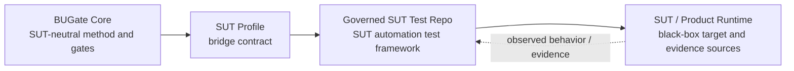

# ADR-BUGATE-001: SUT-Neutral BUGate Core

## Context

BUGate is intended to be a reusable AI black-box test analysis and test-case
governance framework. A reusable framework cannot contain product source code,
product API dumps, environment names, fixed resources, credentials, or
project-specific operating rules.

The coupling boundary is clean enough to separate:

- reusable method and gates,
- SUT profile contracts,
- governed SUT automation test repos,
- product runtime/source/evidence that remains outside BUGate core.

## Decision

BUGate is split into four conceptual parts:

| Part | Ownership | Content |
|---|---|---|
| BUGate Core | This repository | Method, artifact templates, structural gate criteria, hook mechanism, adapter layout. |
| SUT Profile | Committed profile in the governed SUT test repo | Paths, commands, evidence sources, guarded test patterns, resource policy, runtime kind, role policy, namespace. |
| Governed SUT Test Repo | The SUT automation test repository that imports BUGate | Test code, BUGate artifacts, fixtures, runners, generated cases, captured evidence, local test rules. |
| SUT / Product Runtime | Product-owned systems and repositories | Black-box API/UI/runtime behavior, product docs/contracts/environments, optional source/API dumps/secrets, live incidents, and operational evidence. |

Core must not depend on any single SUT kind, path, business entity, environment,
or resource naming scheme.

Importing BUGate therefore means installing the kit into the SUT's test
automation repository, not copying or vendoring the product repository into
BUGate core and not mounting a SUT under BUGate core. Product source can be used
as an evidence source when the SUT profile allows it, but it is never the
default truth for black-box behavior.

## Consequences

- Core becomes portable across different systems under test.
- SUT profiles provide the concrete "teeth" for physical write guards and
  evidence checks inside the governed SUT test repo.
- Core can still define strict invariants, but it must express them in
  SUT-neutral terms.
- SUT-specific learning can be promoted into Core only after it is rewritten as
  a product-neutral rule.
- Product source, API dumps, secrets, and live environment details remain
  outside Core. They belong to the product side, the test workspace, or a
  profile-controlled evidence/config boundary.

## Promotion Rule

A lesson can enter BUGate Core only if it can be stated without referencing a
single SUT's business entities, paths, environments, credentials, or fixtures.
When in doubt, keep it in the SUT profile.

## Implementation Notes

- Runtime adapters live under `.shared/skills/bugate/adapters/`.
- Codex and Claude discovery paths are symlinks to the shared BUGate skill.
- Hook commands locate the engine by walking up for `scripts/bugate_core.py`;
  gate scripts resolve the active project root via the nearest
  `bugate.config.yaml` (the committed config in an imported SUT repo; the
  `AGENTS.md` + `.shared/` sentinel remains only as a pure-core self-check
  fallback). No git metadata required.
- `bugate.config.yaml` ships with no guarded paths. Profiles opt into guarded
  implementation paths.
- In imported mode (CHARTER §2.2, default and only usage mode), the governed
  repo commits its own config + profile. BUGate core development stays pure
  (CHARTER A4): no local profile pointer, symlink, mount, nested checkout, or
  copied real SUT workspace inside the engine repo.

## Rejected Alternatives

- Keep a single product-coupled framework: rejected because it prevents reuse.
- Fork the whole gate stack per product: rejected because rules drift and
  learning does not compound.
- Put all product profiles inside Core: rejected because Core would become a
  product registry instead of a framework.
